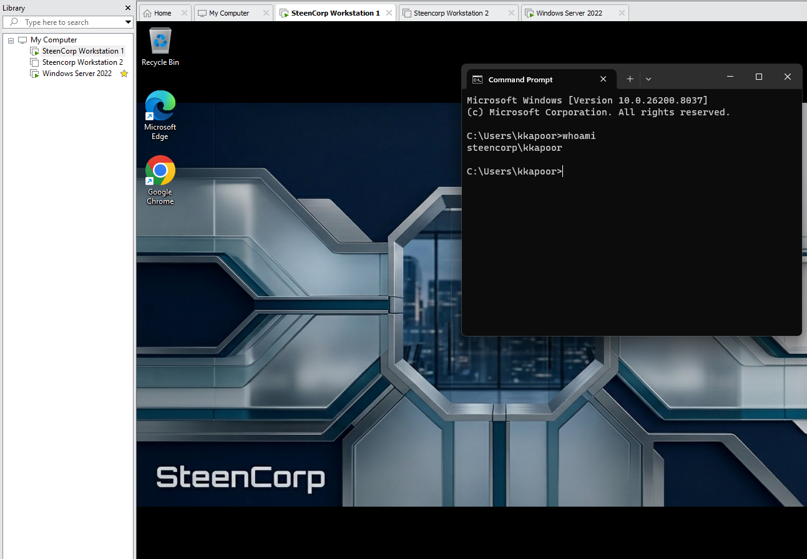
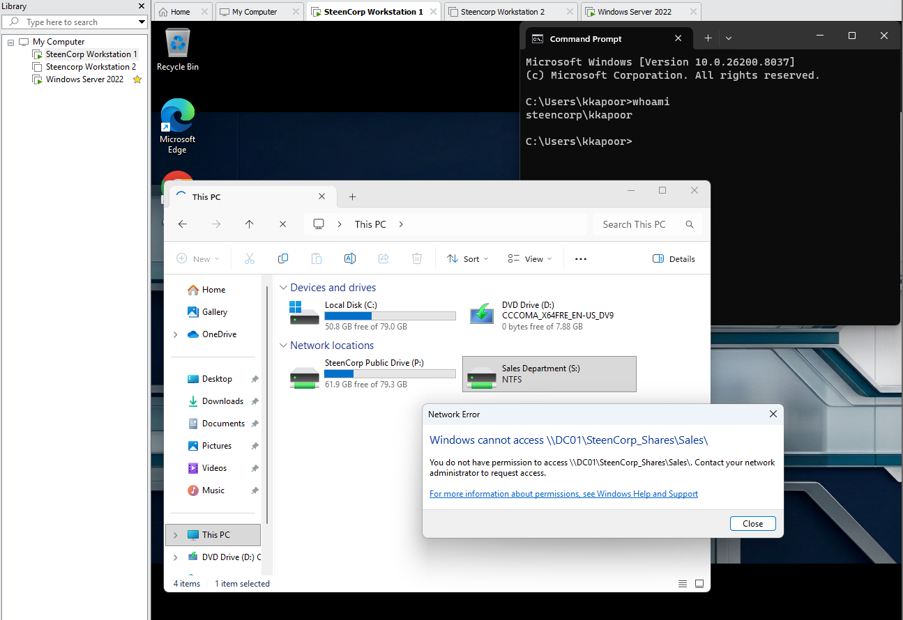
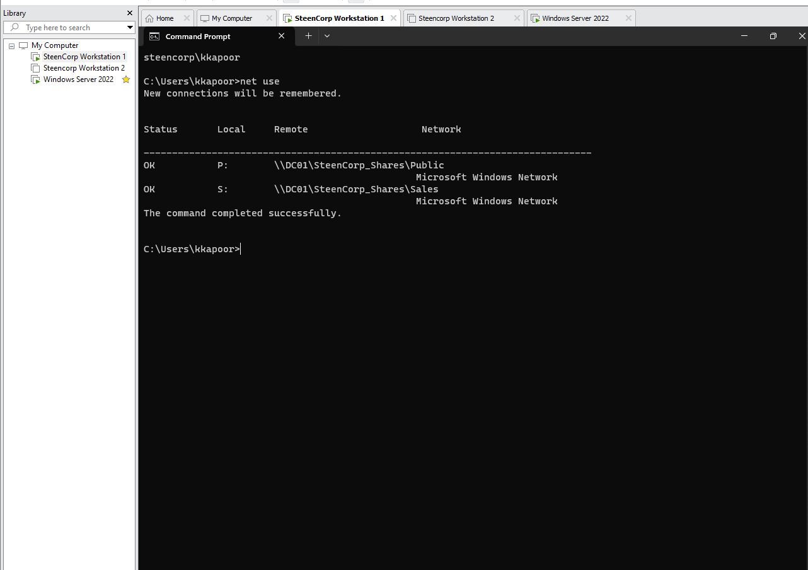
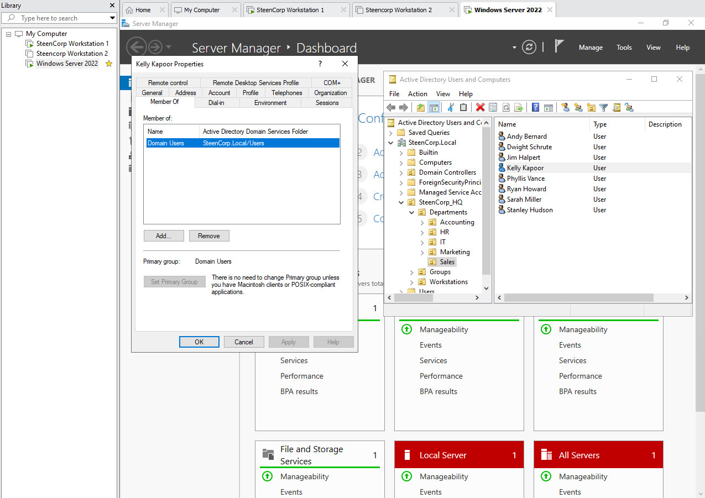
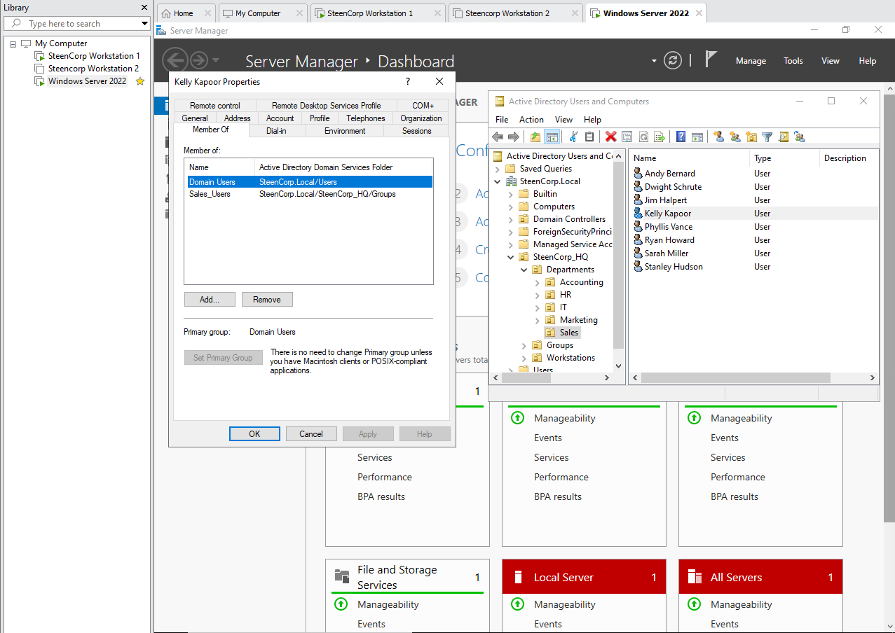
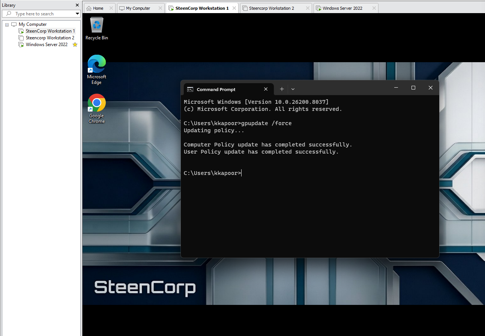
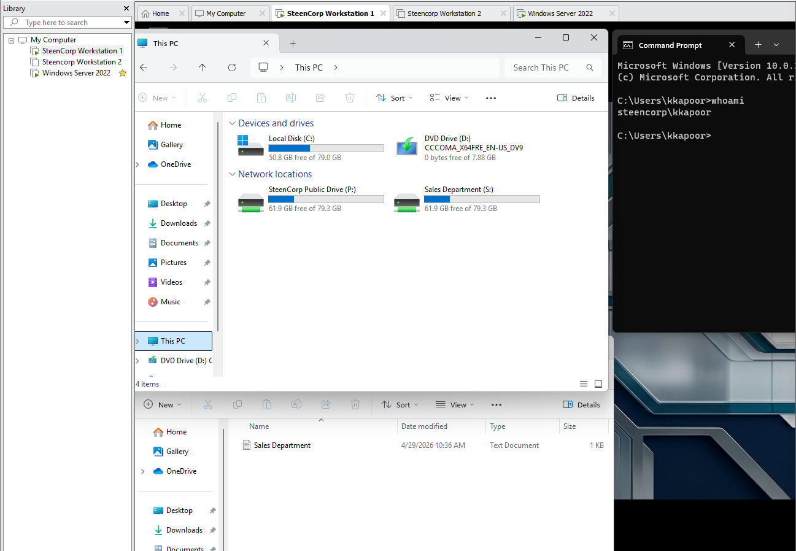

# Ticket #001 – User Cannot Access Shared Drive

## Summary

| Field | Details |
|---|---|
| Status | Resolved |
| Priority | Medium |
| Impact | Single user affected |
| Category | Access / Shared Drive / Permissions |
| User | Kelly Kapoor |
| Department | Sales |
| Affected Resource | Sales department shared drive |
| Environment | SteenCorp Windows Domain |

---

## User Report

Kelly Kapoor from Sales reported that she could sign into her Windows 11 workstation and see the Sales shared drive, but received an access denied error when attempting to open it.

The issue affected one user and blocked access to department files needed for daily work.

---

## Troubleshooting

The issue was first validated from Kelly’s workstation.

```cmd
whoami
net use
```

The workstation confirmed the signed-in user as:

```text
steencorp\kkapoor
```

The Sales shared drive was mapped as `S:`, but access was denied when Kelly attempted to open it.

Since the drive mapping existed, the issue appeared to be related to permissions rather than the drive mapping itself. Active Directory group membership was then reviewed.

Kelly Kapoor was only a member of `Domain Users` and was missing the required `Sales_Users` security group.

---

## Root Cause

Kelly Kapoor was missing from the `Sales_Users` security group in Active Directory.

The Sales shared drive was still mapped to the workstation, but Kelly did not have the required group-based permissions to open the Sales folder.

---

## Resolution

Kelly Kapoor was added back to the `Sales_Users` security group.

Group Policy was refreshed on the client workstation:

```cmd
gpupdate /force
```

After the access correction and policy refresh, the Sales shared drive was tested again from Kelly’s Windows 11 client.

---

## Validation

Validation was completed from the affected workstation while signed in as Kelly Kapoor.

Confirmed:

- Kelly could sign into the domain.
- The Sales shared drive was mapped as `S:`.
- Kelly was missing from the `Sales_Users` group before remediation.
- Kelly was added back to the correct security group.
- Group Policy refreshed successfully.
- Kelly could open the Sales shared drive after remediation.

---

## Evidence

Screenshots are stored in:

```text
Evidence/Helpdesk_Tickets/Ticket001_User_Cannot_Access_Shared_Drive/
```

### Confirmed User Context

This confirmed the affected user was signed in as `steencorp\kkapoor` before troubleshooting the shared drive issue.



---

### Sales Shared Drive Access Denied

This showed that the Sales shared drive was visible to the user, but access was denied when Kelly attempted to open it.



---

### Mapped Drive Status

This confirmed the Sales shared drive was mapped as `S:` to `\\DC01\SteenCorp_Shares\Sales`.



---

### Active Directory Group Membership Review

This showed that Kelly Kapoor was missing the required `Sales_Users` security group.



---

### User Added to Sales Security Group

This documented the access correction by adding Kelly Kapoor back to the `Sales_Users` group.



---

### Group Policy Refreshed

This confirmed Group Policy was refreshed on the client workstation after the access correction.



---

### Sales Shared Drive Access Restored

This validated that Kelly Kapoor could open the Sales shared drive after remediation.



---

## Skills Demonstrated

- Active Directory user support
- Security group troubleshooting
- Shared drive troubleshooting
- Group Policy refresh and validation
- User-side issue confirmation
- Root cause documentation
