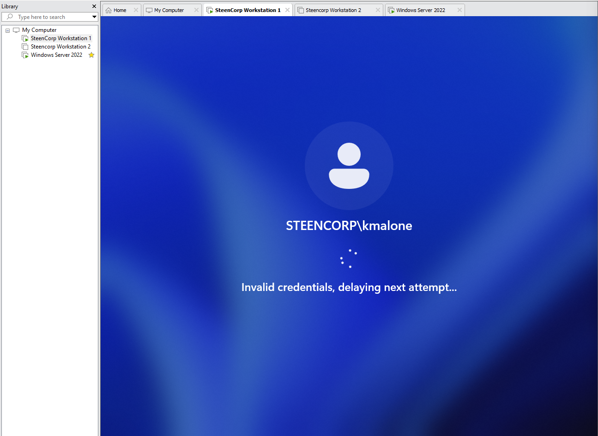
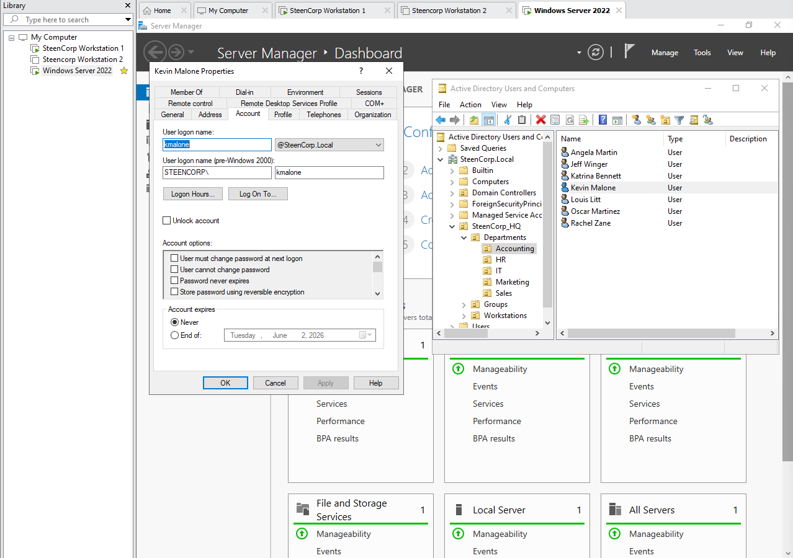
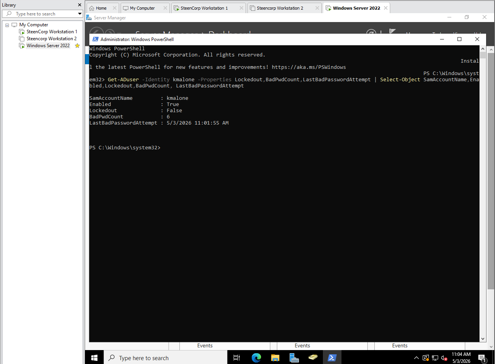
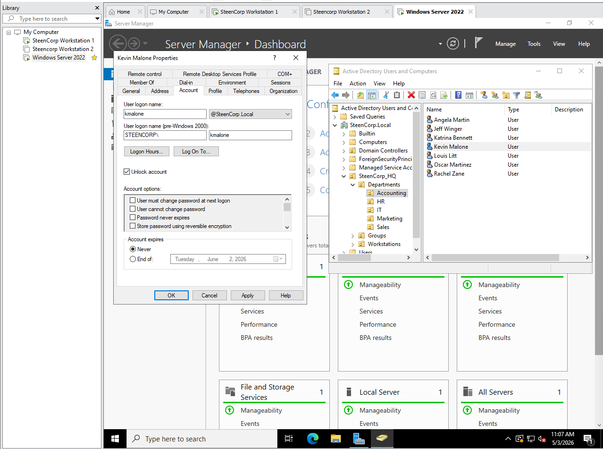
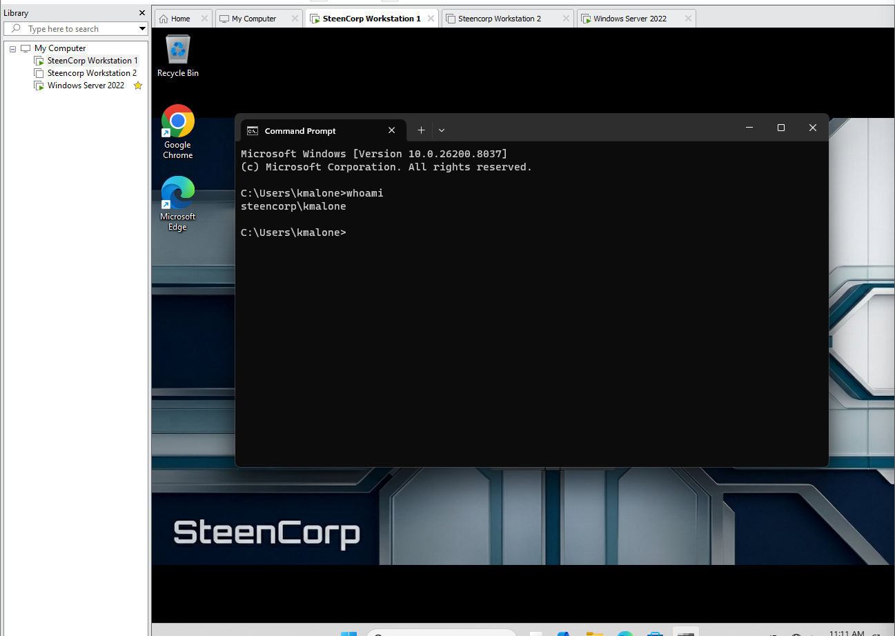

# Ticket #002 – User Account Locked Out

## Ticket Summary

| Field | Details |
|---|---|
| Ticket ID | Ticket #002 |
| Status | Resolved |
| Priority | Medium |
| Impact | Single user affected |
| Category | Account / Authentication |
| User | Kevin Malone |
| Department | Accounting |
| Environment | SteenCorp Windows Domain |
| Affected Resource | Domain user login |
| SLA Response Target | 1 hour |
| SLA Resolution Target | 4 business hours |
| Resolution Status | Resolved within target |

---

## User Report

Kevin Malone from the Accounting department reported that he could not sign into his Windows 11 workstation.

The user stated that he entered his password incorrectly multiple times and was then unable to log in.

---

## Initial Scope

| Check | Result |
|---|---|
| User unable to sign in | Validated |
| Issue affects one user | Validated |
| Workstation is domain joined | Validated |
| Account lockout/sign-in issue suspected | Validated |
| Other users affected | No |

---

## Priority Classification

| Factor | Assessment |
|---|---|
| Business Impact | Medium |
| User Impact | Single user unable to access workstation and domain resources |
| Workaround Available | No direct workaround until account access is restored |
| Priority | Medium |
| Reason | User is blocked from signing into domain resources |

---

## Troubleshooting Summary

The issue was investigated by validating the user sign-in problem, checking the account status in Active Directory, reviewing failed password attempt information, clearing the account lockout condition, and verifying successful user login.

| Step | Check Performed | Result |
|---|---|---|
| 1 | Confirmed user could not sign in | Completed |
| 2 | Reviewed user report of repeated failed password attempts | Completed |
| 3 | Checked Kevin Malone’s account in Active Directory | Completed |
| 4 | Reviewed account unlock option in Active Directory | Unlock option available |
| 5 | Verified failed password attempts using PowerShell | `BadPwdCount` showed repeated failed attempts |
| 6 | Cleared the account lockout condition in Active Directory | Completed |
| 7 | User attempted sign-in again | Successful |
| 8 | Ran `whoami` to confirm signed-in user | Confirmed `steencorp\kmalone` |

---

## Commands Used

| Command | Purpose |
|---|---|
| `Get-ADUser` | Review failed password attempt and account status information |
| `whoami` | Confirm the signed-in domain user after remediation |

---

## Evidence

Screenshots are stored in:

```text
Evidence/Helpdesk_Tickets/Ticket002_User_Account_Locked_Out/
```

| Evidence | Description |
|---|---|
| Screenshot 1 | Kevin unable to sign in after invalid credentials |
| Screenshot 2 | Kevin’s account reviewed in Active Directory |
| Screenshot 3 | PowerShell verification showing repeated failed password attempts |
| Screenshot 4 | Kevin’s account lockout condition cleared |
| Screenshot 5 | Kevin successfully signed in after remediation |

---

## Screenshot Evidence

### 1. Sign-In Failure

Kevin Malone was unable to sign into the Windows 11 workstation after repeated invalid credential attempts.



---

### 2. Active Directory Account Review

Kevin Malone’s account was reviewed in Active Directory Users and Computers. The Account tab showed the unlock option available for administrative action.



---

### 3. PowerShell Failed Password Verification

PowerShell was used to review Kevin Malone’s account status. The output showed repeated failed password attempts with a `BadPwdCount` value of `6`.



---

### 4. Account Lockout Condition Cleared

Kevin Malone’s account lockout condition was cleared in Active Directory.



---

### 5. Successful Login Validation

After remediation, Kevin Malone successfully signed into the workstation. The `whoami` command confirmed the signed-in domain user.



---

## Root Cause

Kevin Malone experienced a sign-in failure after repeated invalid password attempts.

PowerShell showed a `BadPwdCount` value of `6`, indicating multiple failed authentication attempts against the domain account. The issue was likely caused by repeated incorrect password attempts, such as an outdated saved password, Caps Lock being enabled, or the wrong password being entered repeatedly.

---

## Resolution

Kevin Malone’s account was reviewed in Active Directory Users and Computers, and the account lockout condition was cleared.

After remediation, the user attempted to sign into the Windows 11 workstation again using the correct password.

---

## Validation

Validation was completed from the Windows 11 client.

Confirmed:

- Kevin Malone was unable to sign in after repeated invalid credential attempts.
- Active Directory was used to review the user account.
- PowerShell showed repeated failed password attempts with a `BadPwdCount` value of `6`.
- The account lockout condition was cleared by help desk/admin action.
- Kevin Malone successfully signed into the workstation after remediation.
- The `whoami` command confirmed the user was signed in as `steencorp\kmalone`.

---

## Final Ticket Notes

The issue was resolved by reviewing and clearing the user’s Active Directory account lockout condition.

This ticket demonstrated a common help desk workflow involving user intake, account lockout investigation, Active Directory account review, PowerShell verification, remediation, and user-side login validation.

---

## Skills Demonstrated

- Active Directory account support
- Account lockout troubleshooting
- User authentication troubleshooting
- PowerShell account verification
- Help desk ticket documentation
- User-side validation
- SLA-aware support handling
