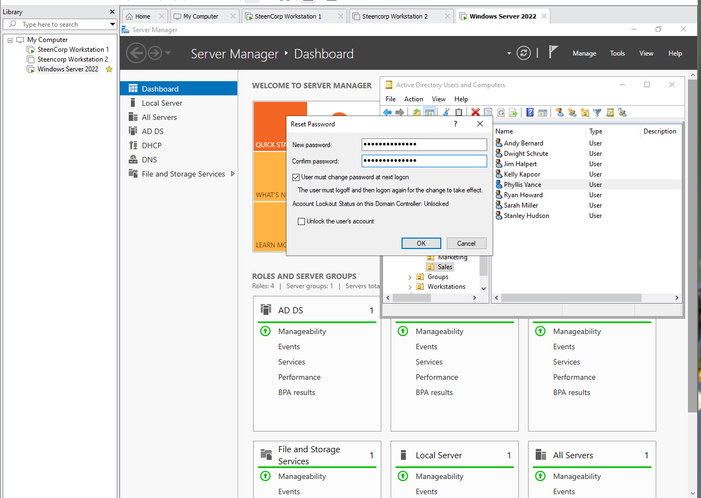
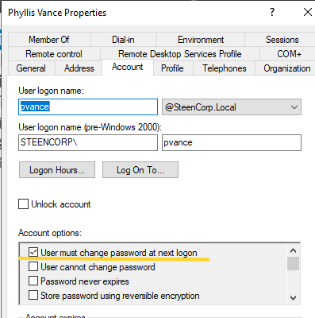

# Ticket #003 – User Forgot Password

## Ticket Summary

| Field | Details |
|---|---|
| Ticket ID | Ticket #003 |
| Status | Planned |
| Priority | Medium |
| Impact | Single user affected |
| Category | Account / Password Reset |
| User | Pam Beesly |
| Department | HR |
| Environment | SteenCorp Windows Domain |
| Affected Resource | Domain user login |
| SLA Response Target | 1 hour |
| SLA Resolution Target | 4 business hours |
| Resolution Status | Pending |

---

## User Report

Pam Beesly from the HR department reported that she forgot her password and cannot sign into her Windows 11 workstation.

The user needs help regaining access to her domain account and workstation.

---

## Initial Scope

| Check | Result |
|---|---|
| User unable to sign in | Pending |
| Issue affects one user | Pending |
| Workstation is domain joined | Pending |
| Password reset required | Pending |
| Other users affected | Pending |

---

## Priority Classification

| Factor | Assessment |
|---|---|
| Business Impact | Medium |
| User Impact | Single user unable to access workstation and domain resources |
| Workaround Available | No direct workaround until password is reset |
| Priority | Medium |
| Reason | User is blocked from signing into domain resources |

---

## Planned Troubleshooting Steps

| Step | Check Performed | Result |
|---|---|---|
| 1 | Confirm user cannot sign in | Pending |
| 2 | Locate Pam Beesly’s account in Active Directory | Pending |
| 3 | Reset the user’s password | Pending |
| 4 | Require password change at next logon | Pending |
| 5 | User signs in with temporary password | Pending |
| 6 | User changes password at login | Pending |
| 7 | Run `whoami` to confirm signed-in user | Pending |

---

## Commands Used

| Command | Purpose |
|---|---|
| `whoami` | Confirm the signed-in domain user after remediation |

---

## Evidence

Screenshots will be stored in:

```text
Evidence/Helpdesk_Tickets/Ticket003_User_Forgot_Password/
```

| Evidence | Description |
|---|---|
| Screenshot 1 | Pam unable to sign in |
| Screenshot 2 | Password reset performed in Active Directory |
| Screenshot 3 | Password change required at next logon |
| Screenshot 4 | User prompted to change password |
| Screenshot 5 | Successful login confirmed with `whoami` |

---

## Screenshot Evidence

### 1. Failed Login Attempt

Pending screenshot.


---

### 2. Active Directory Password Reset

Pending screenshot.



---

### 3. Password Change Required at Next Logon

Pending screenshot.



---

### 4. User Prompted to Change Password

Pending screenshot.


---

### 5. Successful Login Validation

Pending screenshot.


---

## Root Cause

Pending investigation.

Expected root cause:

Pam Beesly was unable to sign into the domain because she did not know her current password.

---

## Resolution

Pending remediation.

Expected resolution:

Pam Beesly’s password will be reset in Active Directory Users and Computers. The account will be configured to require a password change at next logon so the user can create a new private password.

---

## Validation

Pending user-side validation.

Expected validation:

- Pam signs in using the temporary password.
- Pam is prompted to change her password.
- Pam successfully signs into the Windows 11 workstation.
- The `whoami` command confirms the signed-in user as `steencorp\pbeesly`.

---

## Final Ticket Notes

Pending completion.

This ticket is being used to demonstrate a common help desk workflow involving user intake, password reset handling, Active Directory account management, and user-side login validation.

---

## Skills Demonstrated

- Active Directory password reset support
- User authentication troubleshooting
- Password change at next logon
- Help desk ticket documentation
- User-side validation
- SLA-aware support handling
