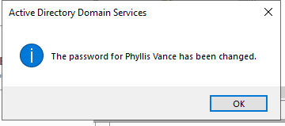
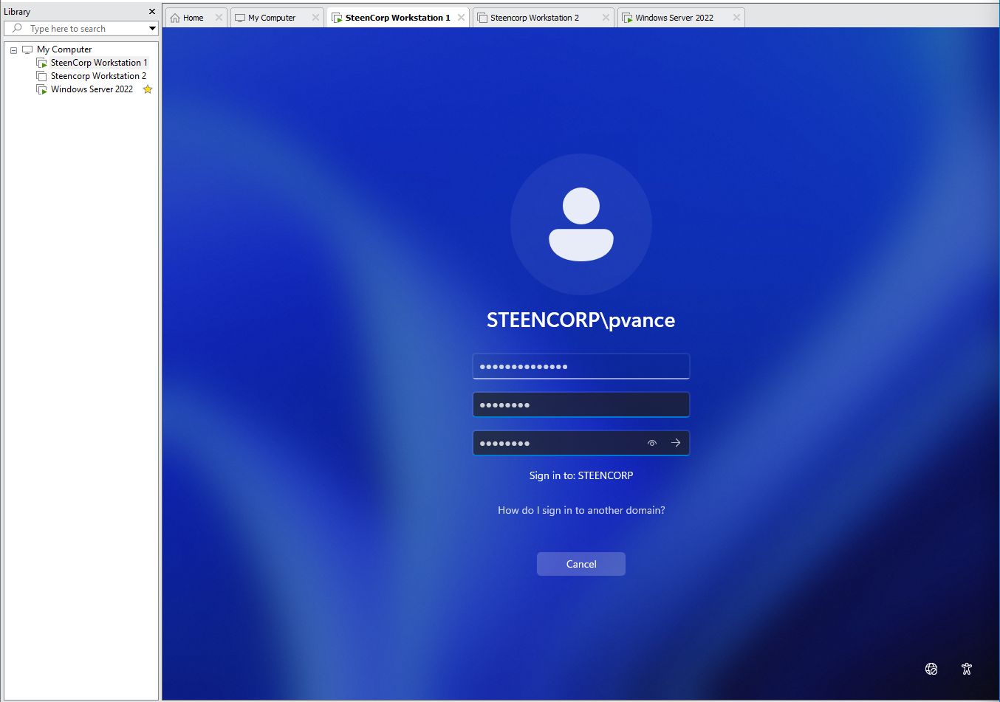
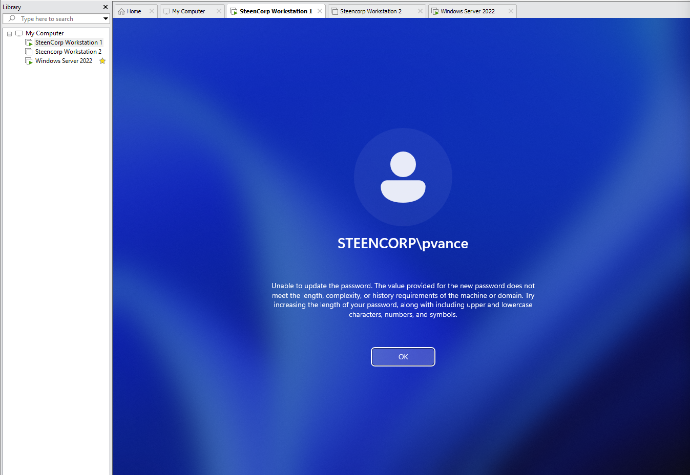
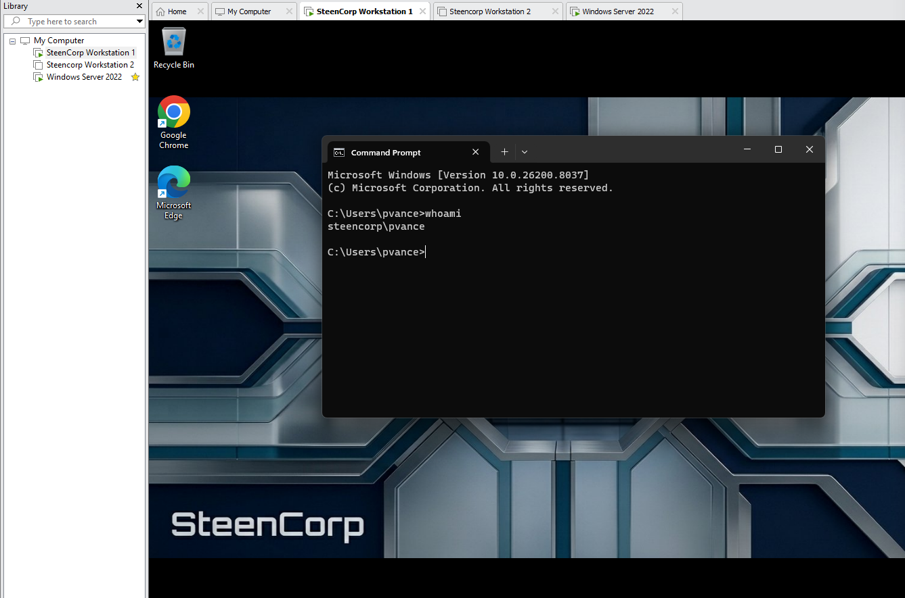

# Ticket #003 – User Forgot Password

## Ticket Summary

| Field | Details |
|---|---|
| Ticket ID | Ticket #003 |
| Status | Resolved |
| Priority | Medium |
| Impact | Single user affected |
| Category | Account / Password Reset |
| User | Phyllis Vance |
| Department | Sales |
| Environment | SteenCorp Windows Domain |
| Affected Resource | Domain user login |
| SLA Response Target | 1 hour |
| SLA Resolution Target | 4 business hours |
| Resolution Status | Resolved within target |

---

## User Report

Phyllis Vance from the Sales department reported that she forgot her password and could not sign into her Windows 11 workstation.

The user needed help regaining access to her domain account and workstation.

---

## Initial Scope

| Check | Result |
|---|---|
| User unable to sign in | Validated |
| Issue affects one user | Validated |
| Workstation is domain joined | Validated |
| Password reset required | Validated |
| Other users affected | No |

---

## Priority Classification

| Factor | Assessment |
|---|---|
| Business Impact | Medium |
| User Impact | Single user unable to access workstation and domain resources |
| Workaround Available | No direct workaround until password is reset |
| Priority | Medium |
| Reason | User is blocked from signing into domain resources |

---

## Troubleshooting Summary

The issue was handled by confirming the failed sign-in, resetting the user’s password in Active Directory, requiring a password change at next logon, and validating successful sign-in from the Windows 11 client.

During the password change process, the user initially attempted a new password that did not meet the domain password policy or password history requirements. The user then created a compliant password and completed the sign-in process successfully.

| Step | Check Performed | Result |
|---|---|---|
| 1 | Confirmed user could not sign in | Completed |
| 2 | Located Phyllis Vance’s account in Active Directory | Completed |
| 3 | Reset the user’s password | Completed |
| 4 | Required password change at next logon | Completed |
| 5 | Confirmed password reset completed | Completed |
| 6 | User signed in with temporary password | Completed |
| 7 | User was prompted to change password | Completed |
| 8 | User attempted password change | Initial attempt did not meet policy/history requirements |
| 9 | User created compliant new password | Completed |
| 10 | Ran `whoami` to confirm signed-in user | Confirmed `steencorp\pvance` |

---

## Commands Used

| Command | Purpose |
|---|---|
| `whoami` | Confirm the signed-in domain user after remediation |

---

## Evidence

Screenshots are stored in:

```text
Evidence/Helpdesk_Tickets/Ticket003_User_Forgot_Password/
```

| Evidence | Description |
|---|---|
| Screenshot 1 | Phyllis unable to sign in |
| Screenshot 2 | Password reset performed in Active Directory |
| Screenshot 3 | Password change required at next logon confirmed |
| Screenshot 4 | Password reset confirmation |
| Screenshot 5 | User prompted to change password |
| Screenshot 6 | Password policy/history requirement encountered |
| Screenshot 7 | Password changed successfully |
| Screenshot 8 | Successful login confirmed with `whoami` |

---

## Screenshot Evidence

### 1. Failed Login Attempt

Phyllis Vance was unable to sign into the Windows 11 workstation with her previous/unknown password.


---

### 2. Active Directory Password Reset

The password was reset in Active Directory Users and Computers. A temporary password was issued, and the account was configured to require a password change at next logon.


---

### 3. Password Change Required at Next Logon

Phyllis Vance’s account was reviewed to confirm that the account was configured to require a password change at next logon.


---

### 4. Password Reset Confirmation

Active Directory confirmed that the password for Phyllis Vance was changed.



---

### 5. Password Change Required on Login

After signing in with the temporary password, Phyllis was prompted to change her password before accessing the workstation.



---

### 6. Password Policy / History Requirement

The initial new password attempt did not meet the domain password policy or password history requirements.



---

### 7. Successful Password Change

Phyllis created a compliant new password, and Windows confirmed that the password was changed successfully.


---

### 8. Successful Login Validation

After remediation, Phyllis successfully signed into the workstation. The `whoami` command confirmed the signed-in domain user.



---

## Root Cause

Phyllis Vance was unable to sign into the domain because she did not know her current password.

The issue required a standard Active Directory password reset and a forced password change at next logon so the user could create a new private password.

A secondary password change issue occurred when the user attempted to create a new password that did not meet the domain password policy or password history requirements.

---

## Resolution

Phyllis Vance’s password was reset in Active Directory Users and Computers.

A temporary password was issued, and the account was configured to require a password change at next logon. Phyllis signed in using the temporary password and was prompted to create a new password.

After an initial password attempt did not meet domain policy requirements, Phyllis created a compliant password and successfully completed the login process.

---

## Validation

Validation was completed from the Windows 11 client.

Confirmed:

- Phyllis Vance was unable to sign in with her previous/unknown password.
- Phyllis’s password was reset in Active Directory.
- A temporary password was issued.
- The account was configured to require a password change at next logon.
- The user was prompted to change her password during login.
- The first new password attempt did not meet domain password policy or history requirements.
- The user created a compliant password successfully.
- The `whoami` command confirmed the user was signed in as `steencorp\pvance`.

---

## Final Ticket Notes

The issue was resolved by resetting the user’s password in Active Directory and requiring a password change at next logon.

This ticket also demonstrated password policy enforcement because the user initially attempted a new password that did not meet domain requirements. After creating a compliant password, the user was able to sign in successfully.

This ticket demonstrated a common help desk workflow involving user intake, password reset handling, Active Directory account management, password policy awareness, and user-side login validation.

---

## Skills Demonstrated

- Active Directory password reset support
- User authentication troubleshooting
- Password change at next logon
- Password policy awareness
- Password history requirement troubleshooting
- Help desk ticket documentation
- User-side validation
- SLA-aware support handling
