# Ticket #004 – User Cannot Access Network Share by Hostname

## Ticket Summary

| Field | Details |
|---|---|
| Ticket ID | Ticket #004 |
| Status | Resolved |
| Priority | Medium |
| Impact | Single user/workstation affected |
| Category | Network / DNS / Shared Resource Access |
| User | Jim Halpert |
| Department | Sales |
| Environment | SteenCorp Windows Domain |
| Affected Resource | `\\DC01.steencorp.local\SteenCorp_Shares` |
| SLA Response Target | 1 hour |
| SLA Resolution Target | 4 business hours |
| Resolution Status | Resolved within target |

---

## User Report

Jim Halpert from the Sales department reported that he could not access the company network share using the server hostname.

The user could sign into the workstation successfully, but the shared folder path was not opening.

Affected path:

```text
\\DC01.steencorp.local\SteenCorp_Shares
```

---

## Initial Scope

| Check | Result |
|---|---|
| User can sign into workstation | Validated |
| Issue affects one user/workstation | Validated |
| Shared folder path inaccessible by hostname | Validated |
| Basic IP connectivity to domain controller | Validated |
| Hostname resolution issue suspected | Validated |
| Other users affected | No |

---

## Priority Classification

| Factor | Assessment |
|---|---|
| Business Impact | Medium |
| User Impact | Single user unable to access expected company shared resource by hostname |
| Workaround Available | Limited workaround may exist, but hostname access is expected in the domain |
| Priority | Medium |
| Reason | User can sign in, but cannot access an expected network resource |

---

## Troubleshooting Summary

The issue was investigated by confirming the signed-in user, attempting to access the shared folder by hostname, testing IP connectivity, testing hostname resolution, reviewing workstation DNS settings, correcting the DNS configuration, flushing the DNS cache, and validating restored access.

The workstation was able to reach the domain controller by IP address, but hostname-based access failed. This helped narrow the issue from general network connectivity to DNS/name resolution.

The workstation was using an external DNS server instead of the SteenCorp domain controller. Because Active Directory domain environments rely on internal DNS, the workstation could not properly resolve the internal domain controller hostname.

| Step | Check Performed | Result |
|---|---|---|
| 1 | Confirmed signed-in user with `whoami` | Confirmed `steencorp\jhalpert` |
| 2 | Attempted to access network share by hostname | Failed |
| 3 | Tested hostname resolution with `nslookup dc01.steencorp.local` | Failed |
| 4 | Reviewed workstation DNS settings with `ipconfig /all` | DNS server showed `8.8.8.8` |
| 5 | Tested connectivity to DC01 by IP using `ping 192.168.10.10` | Successful |
| 6 | Tested hostname connectivity using `ping dc01.steencorp.local` | Failed |
| 7 | Tested route to DC01 by IP using `tracert 192.168.10.10` | Successful |
| 8 | Identified incorrect DNS server as likely root cause | Completed |
| 9 | Corrected DNS server to domain controller | Set to `192.168.10.10` |
| 10 | Flushed DNS cache | Completed |
| 11 | Retested hostname resolution | Successful |
| 12 | Reopened network share by hostname | Successful |
| 13 | Validated Sales folder access | Successful |
| 14 | Validated IT folder access remained restricted | Access denied as expected |

---

## Commands Used

| Command | Purpose |
|---|---|
| `whoami` | Confirm the signed-in domain user |
| `nslookup dc01.steencorp.local` | Test DNS name resolution for the domain controller |
| `ipconfig /all` | Review workstation IP and DNS configuration |
| `ping 192.168.10.10` | Test basic connectivity to the domain controller by IP address |
| `ping dc01.steencorp.local` | Test hostname-based connectivity |
| `tracert 192.168.10.10` | Confirm route to the domain controller by IP address |
| `ipconfig /flushdns` | Clear local DNS resolver cache |
| `Set-DnsClientServerAddress` | Correct workstation DNS server settings |

---

## Evidence

Screenshots are stored in:

```text
Evidence/Helpdesk_Tickets/Ticket004_User_Cannot_Access_Network_Share_by_Hostname/
```

| Evidence | Description |
|---|---|
| Screenshot 1 | Jim signed in as domain user |
| Screenshot 2 | Network share path not accessible by hostname |
| Screenshot 3 | `nslookup` fails for `dc01.steencorp.local` |
| Screenshot 4 | Workstation DNS settings show incorrect DNS server |
| Screenshot 4A | Ping to DC01 by IP succeeds |
| Screenshot 4B | Hostname ping/tracert test fails |
| Screenshot 4C | Tracert to DC01 by IP succeeds |
| Screenshot 5 | DNS corrected and hostname resolution restored |
| Screenshot 6 | Network share access restored |
| Screenshot 6A | IT folder access denied as expected |
| Screenshot 6B | Sales folder access confirmed |

---

## Screenshot Evidence

### 1. Confirmed User Context

Jim Halpert was signed into the workstation as a domain user.

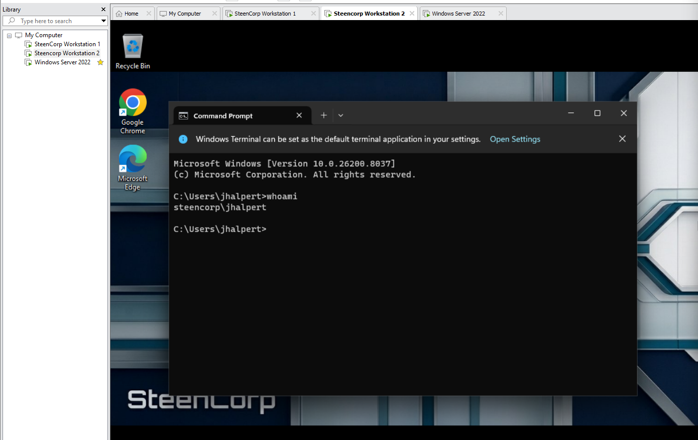

---

### 2. Shared Path Not Accessible

The network share path failed to open using the domain controller hostname.

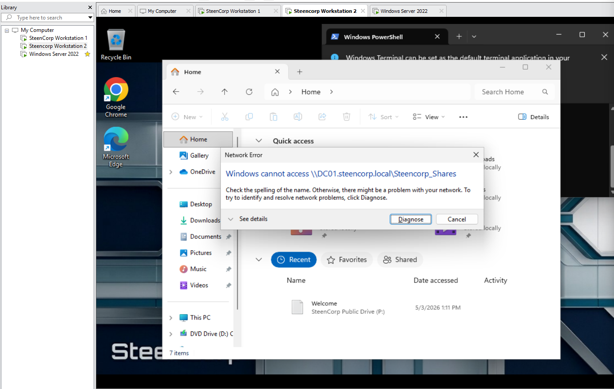

---

### 3. Hostname Resolution Failure

`nslookup` failed when attempting to resolve `dc01.steencorp.local`. The output showed DNS requests timing out while using the incorrect DNS server.

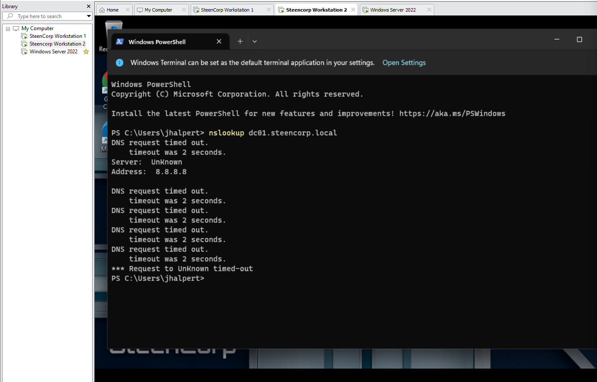

---

### 4. Incorrect DNS Configuration

The workstation DNS configuration was reviewed with `ipconfig /all`. The workstation was using `8.8.8.8` instead of the SteenCorp domain controller for DNS.

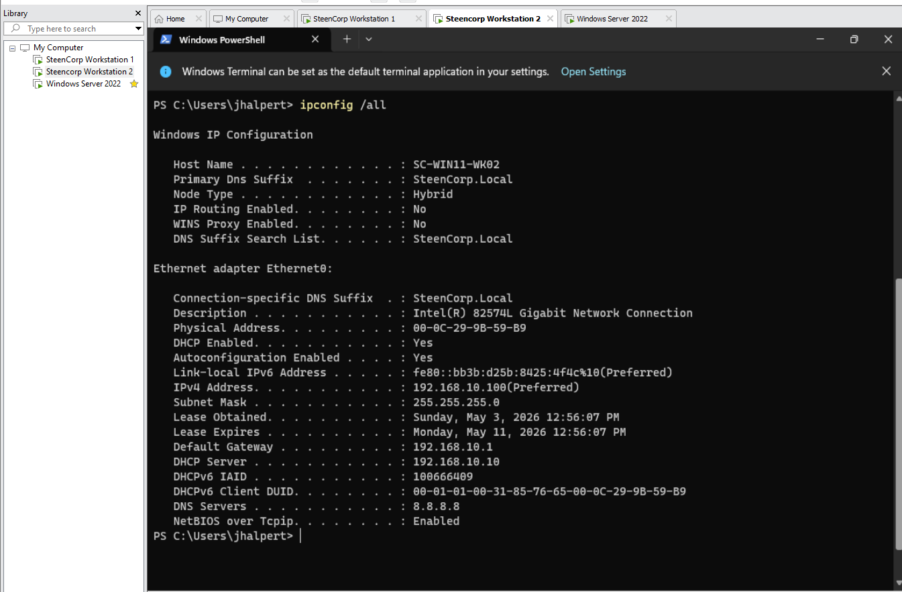

---

### 5. IP Connectivity to Domain Controller Confirmed

A ping test to the domain controller IP address succeeded. This confirmed that basic network connectivity to DC01 was working.

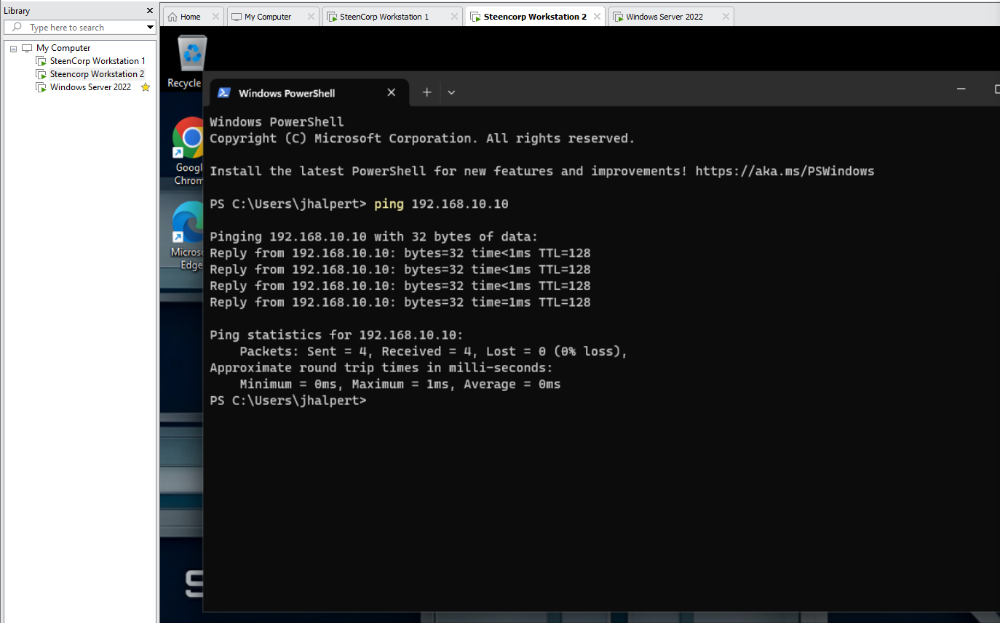

---

### 6. Hostname Connectivity Failed

A hostname-based ping and traceroute test failed, showing that the workstation could not resolve the internal domain controller hostname.

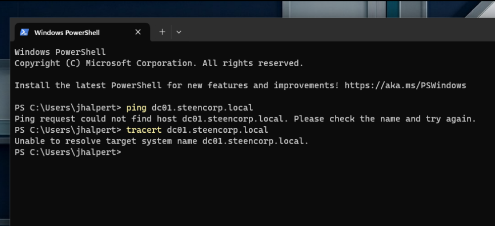

---

### 7. Route to Domain Controller by IP Confirmed

A traceroute to the domain controller IP address completed successfully. This further confirmed that the workstation could reach DC01 by IP.

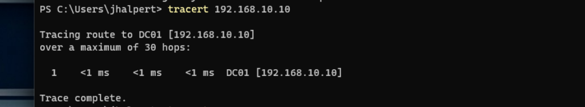

---

### 8. DNS Corrected and Name Resolution Restored

The workstation DNS server was corrected to use the domain controller at `192.168.10.10`. After flushing the DNS cache, `nslookup` successfully resolved `dc01.steencorp.local`.

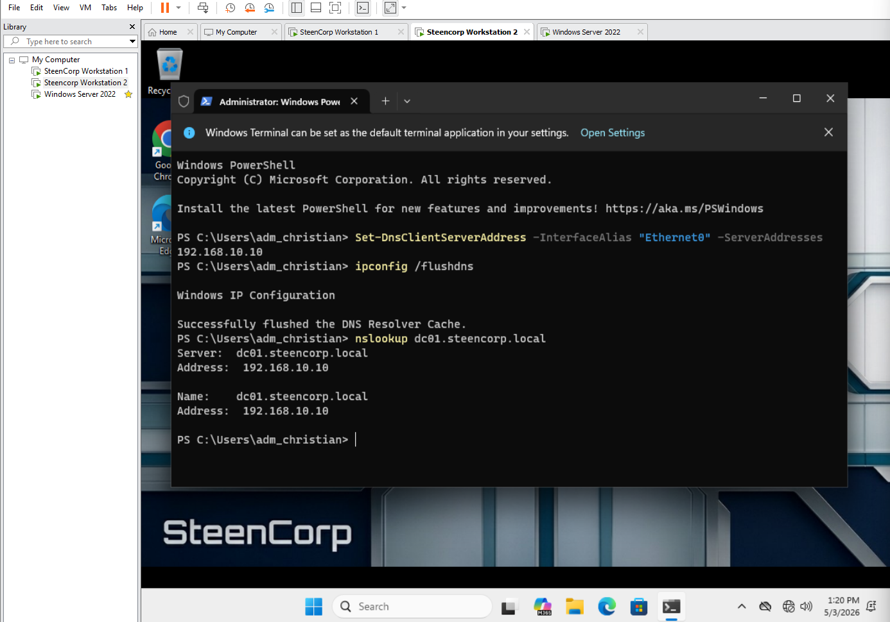

---

### 9. Shared Path Access Restored

After DNS was corrected, Jim was able to access the main SteenCorp shared folder path by hostname.

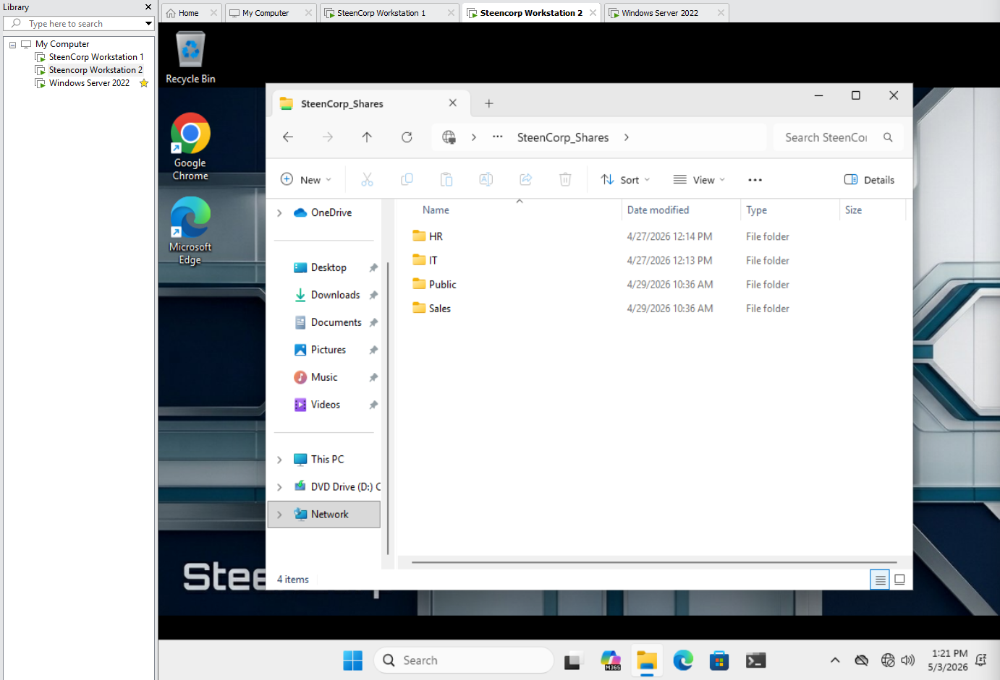

---

### 10. Restricted Folder Access Still Enforced

Jim attempted to access the IT folder and was denied access as expected. This confirmed that restoring DNS access did not bypass role-based access controls.

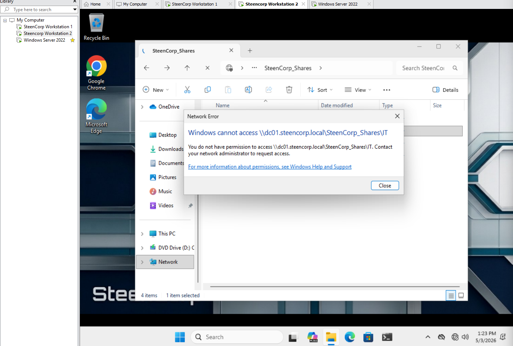

---

### 11. Sales Folder Access Confirmed

Jim was able to access the Sales folder successfully, confirming that the correct department access was restored.

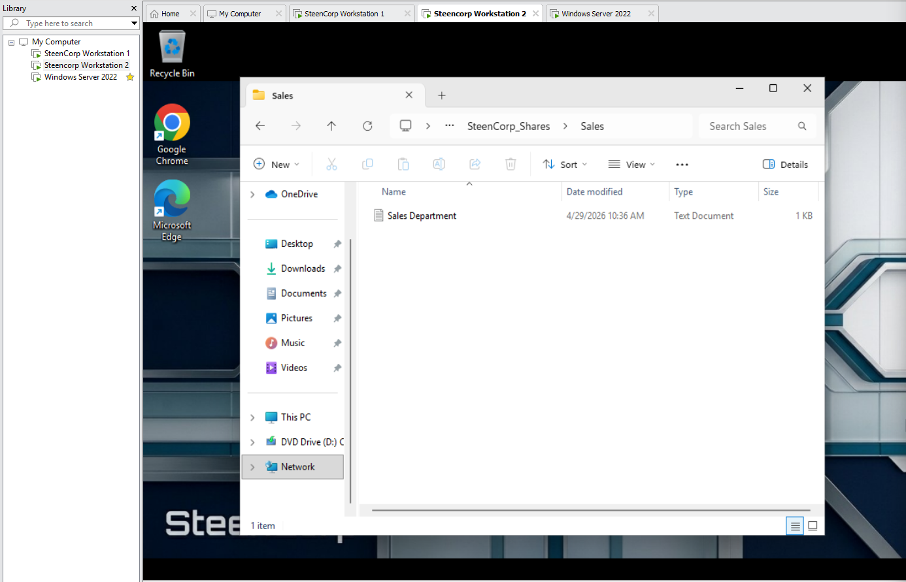

---

## Root Cause

The workstation was using incorrect DNS settings.

The DNS server was set to `8.8.8.8`, which prevented the workstation from resolving the internal Active Directory domain controller hostname `dc01.steencorp.local`.

Basic IP connectivity to the domain controller was working, but hostname resolution failed. This confirmed that the issue was DNS-related rather than a general network connectivity failure.

Because Active Directory domain environments rely on internal DNS, domain-joined workstations should use the domain controller for DNS resolution.

---

## Resolution

The workstation DNS server was corrected to use the SteenCorp domain controller at `192.168.10.10`.

After correcting the DNS server setting, the DNS resolver cache was flushed and hostname resolution was tested again. The workstation successfully resolved `dc01.steencorp.local`, and Jim was able to access the shared folder path by hostname.

---

## Validation

Validation was completed from the Windows 11 client.

Confirmed:

- Jim Halpert was signed in as `steencorp\jhalpert`.
- The network share path failed before remediation.
- `nslookup dc01.steencorp.local` failed while the workstation used incorrect DNS.
- `ipconfig /all` showed the workstation was using `8.8.8.8` for DNS.
- `ping 192.168.10.10` confirmed the workstation could reach DC01 by IP.
- `ping dc01.steencorp.local` failed, confirming hostname resolution was not working.
- `tracert 192.168.10.10` confirmed the workstation could route to DC01 by IP.
- DNS was corrected to use the domain controller at `192.168.10.10`.
- `nslookup dc01.steencorp.local` successfully resolved to `192.168.10.10`.
- Jim could access `\\DC01.steencorp.local\SteenCorp_Shares`.
- Jim could access the Sales folder.
- Jim could not access the IT folder, confirming least privilege permissions remained enforced.

---

## Final Ticket Notes

The issue was resolved by correcting the workstation DNS configuration and validating hostname resolution.

This ticket demonstrated a common help desk workflow involving shared resource access, DNS troubleshooting, workstation network configuration review, command-line validation, and user-side confirmation.

The troubleshooting process confirmed that basic IP connectivity was working, while hostname resolution was failing. This helped isolate the issue to DNS configuration rather than general network connectivity.

The final validation also confirmed that role-based access controls remained in place after network access was restored.

---

## Skills Demonstrated

- DNS troubleshooting
- Hostname resolution testing
- Shared folder access troubleshooting
- Windows workstation network configuration review
- PowerShell network configuration
- Ping and traceroute testing
- Command-line validation
- Active Directory domain DNS awareness
- Least privilege validation
- Help desk ticket documentation
- User-side validation
