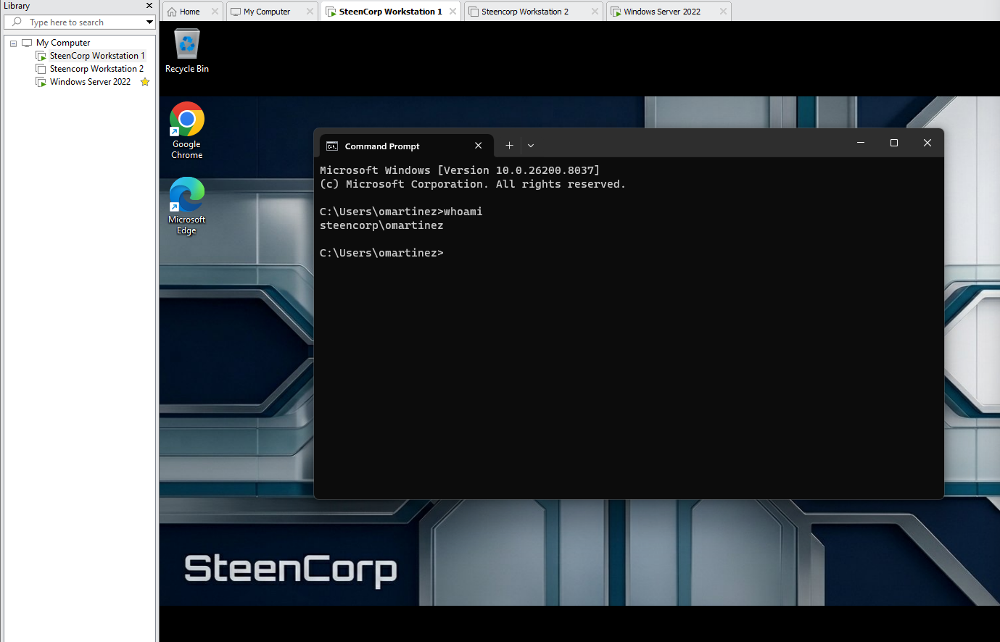

# Ticket #005 – User Cannot Install Approved Software

## Ticket Summary

| Field | Details |
|---|---|
| Ticket ID | Ticket #005 |
| Status | Planned |
| Priority | Low |
| Impact | Single user affected |
| Category | Workstation / Software Support |
| User | Oscar Martinez |
| Department | Accounting |
| Environment | SteenCorp Windows Domain |
| Affected Resource | 7-Zip installation |
| Software Requested | 7-Zip |
| SLA Response Target | 4 business hours |
| SLA Resolution Target | 1 business day |
| Resolution Status | Pending |

---

## User Report

Oscar Martinez from the Accounting department requested 7-Zip to be installed on his workstation for business use.

The user reported that he could not complete the installation because administrative approval was required.

---

## Initial Scope

| Check | Result |
|---|---|
| User can sign in | Pending |
| Issue affects one user/workstation | Pending |
| Software request is approved | Pending |
| User lacks local admin rights | Pending |
| Admin approval required | Pending |

---

## Priority Classification

| Factor | Assessment |
|---|---|
| Business Impact | Low |
| User Impact | Single user requesting approved software installation |
| Workaround Available | User can continue working without immediate installation |
| Priority | Low |
| Reason | Software request affects one user and is not a critical outage |

---

## Planned Troubleshooting Steps

| Step | Check Performed | Result |
|---|---|---|
| 1 | Confirm user is signed in as a standard domain user | Pending |
| 2 | Attempt 7-Zip installation | Pending |
| 3 | Confirm administrator approval is required | Pending |
| 4 | Review least privilege impact | Pending |
| 5 | Install 7-Zip using admin credentials | Pending |
| 6 | Launch 7-Zip to confirm successful installation | Pending |

---

## Commands Used

| Command | Purpose |
|---|---|
| `whoami` | Confirm the signed-in domain user |
| `whoami /groups` | Optional check to review user group context |

---

## Evidence

Screenshots will be stored in:

```text
Evidence/Helpdesk_Tickets/Ticket005_Approved_Software_Install/
```

| Evidence | Description |
|---|---|
| Screenshot 1 | Oscar signed in as standard domain user |
| Screenshot 2 | 7-Zip installation blocked by admin prompt |
| Screenshot 3 | Admin approval used for installation |
| Screenshot 4 | 7-Zip installation completed successfully |
| Screenshot 5 | 7-Zip launched successfully after install |

---

## Screenshot Evidence

### 1. Confirmed Standard User Context

Pending screenshot.



---

### 2. 7-Zip Installation Requires Administrator Approval

Pending screenshot.


---

### 3. Admin Approval Used for Installation

Pending screenshot.


---

### 4. 7-Zip Installed Successfully

Pending screenshot.


---

### 5. 7-Zip Launch Confirmed

Pending screenshot.


---

## Root Cause

Pending investigation.

Expected root cause:

Oscar Martinez is a standard domain user and does not have permission to install software locally.

This behavior is expected under least privilege because standard users should not have unrestricted local administrator rights.

---

## Resolution

Pending remediation.

Expected resolution:

Help desk will install the approved 7-Zip software using administrative credentials instead of granting the user local administrator rights.

---

## Validation

Pending user-side validation.

Expected validation:

- Oscar remains a standard domain user.
- 7-Zip is installed successfully.
- 7-Zip launches after installation.
- The issue is resolved without granting unnecessary local administrator permissions.

---

## Final Ticket Notes

Pending completion.

This ticket is being used to demonstrate a common help desk workflow involving approved software installation, administrative elevation, standard user permissions, and least privilege support.

---

## Skills Demonstrated

- Workstation software support
- Standard user permission troubleshooting
- Administrative elevation handling
- Least privilege awareness
- Approved software installation support
- Help desk ticket documentation
- User-side validation
