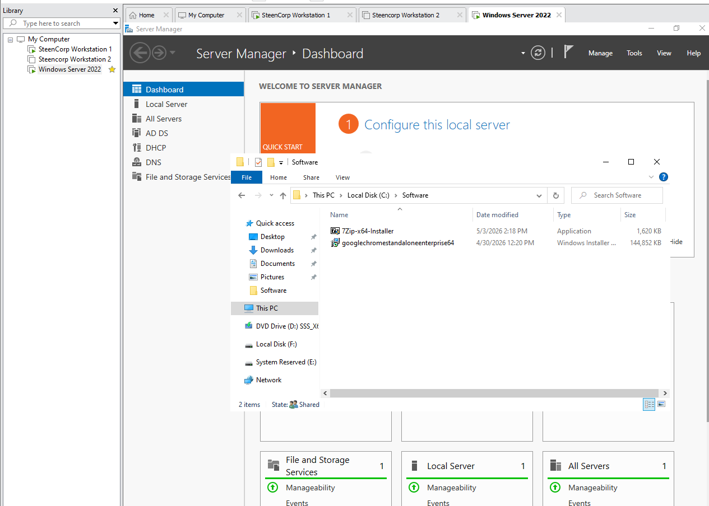
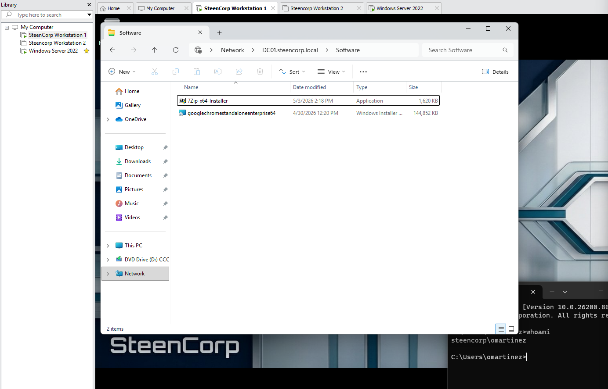
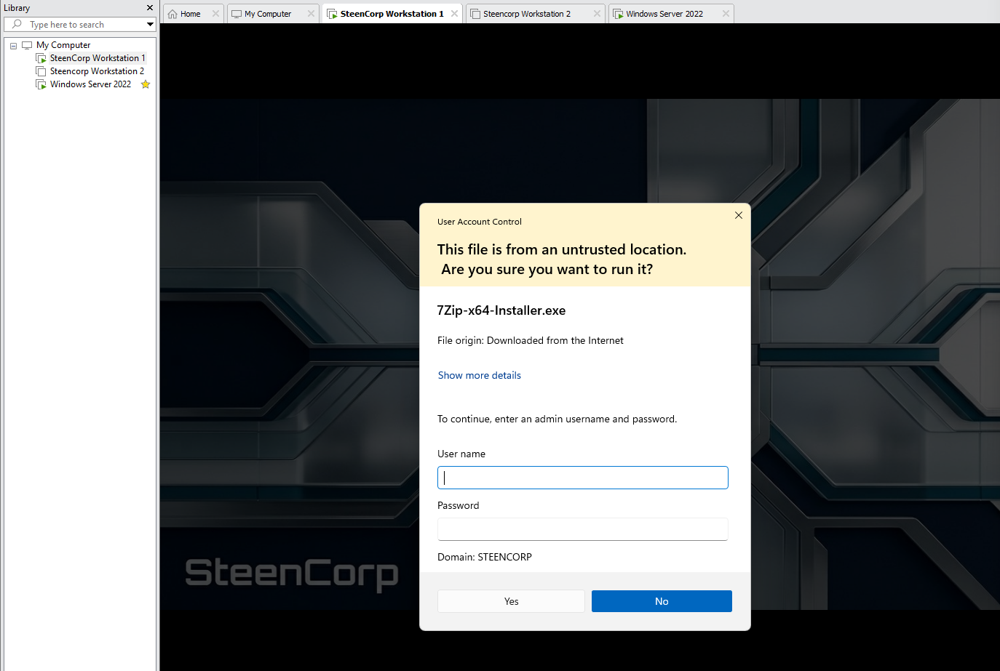
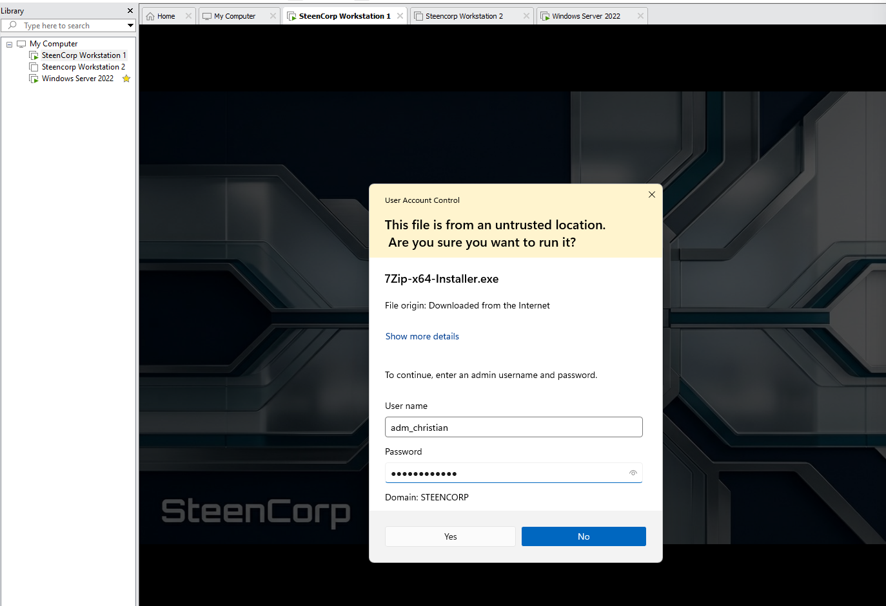
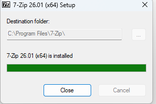
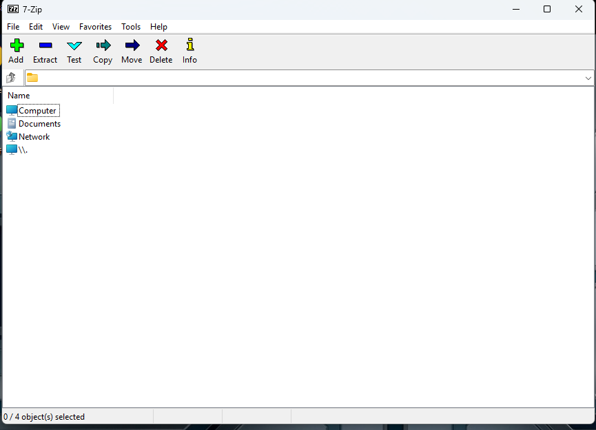
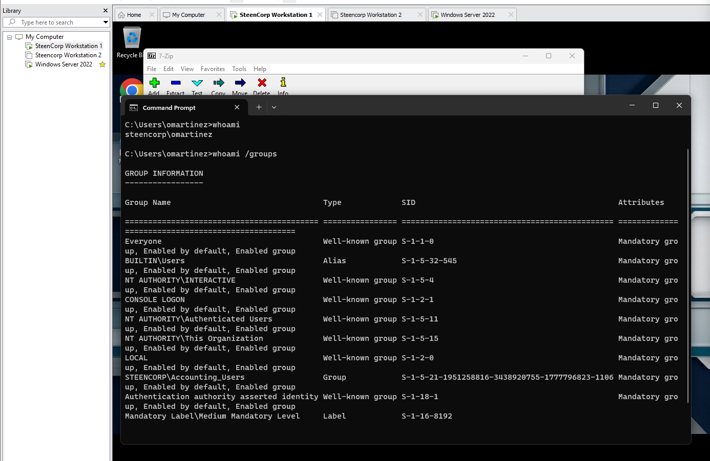

# Ticket #005 – User Cannot Install Approved Software

## Summary

| Field | Details |
|---|---|
| Status | Resolved |
| Priority | Low |
| Impact | Single user affected |
| Category | Workstation / Software Support |
| User | Oscar Martinez |
| Department | Accounting |
| Affected Resource | 7-Zip installation |
| Software Requested | 7-Zip |
| Environment | SteenCorp Windows Domain |

---

## User Report

Oscar Martinez from Accounting submitted a help desk request for 7-Zip to be installed for approved business use.

Oscar did not have local administrator rights and could not install the software himself.

The issue affected one user and was handled as a low-priority approved software request.

---

## Troubleshooting

The request was first validated from Oscar’s workstation.

```cmd
whoami
```

The signed-in user was confirmed as:

```text
steencorp\omartinez
```

Because Oscar was a standard domain user, the installer required administrator approval before it could be installed.

The approved 7-Zip installer was downloaded from the official vendor source by help desk and staged in SteenCorp’s internal software repository:

```text
\\DC01.steencorp.local\Software
```

Oscar was able to access the internal software share and locate the installer, but Windows required administrative approval to complete the installation.

Help desk approved the installation using administrative credentials without granting Oscar local administrator rights.

After installation, Oscar’s group context was checked with:

```cmd
whoami /groups
```

This confirmed Oscar remained a standard user after the software was installed.

---

## Root Cause

Oscar Martinez was a standard domain user and did not have permission to install software locally without administrator approval.

This behavior was expected and aligned with least privilege. Standard users should not have unrestricted local administrator rights on company workstations.

---

## Resolution

The approved 7-Zip installer was staged in the internal SteenCorp software share.

Help desk used administrative credentials to approve and complete the installation on Oscar’s workstation.

Oscar was not granted local administrator rights.

---

## Validation

Validation was completed from the Windows workstation.

Confirmed:

- Oscar was signed in as `steencorp\omartinez`.
- The approved 7-Zip installer was staged internally.
- Oscar could access `\\DC01.steencorp.local\Software`.
- The installer required administrator approval.
- Help desk approved the installation with admin credentials.
- 7-Zip installed successfully.
- 7-Zip launched successfully for Oscar.
- Oscar remained a standard user after installation.
- Least privilege was maintained.

---

## Evidence

Screenshots are stored in:

```text
Evidence/Helpdesk_Tickets/Ticket005_Approved_Software_Install/
```

### Confirmed Standard User Context

This confirmed Oscar was signed into the workstation as `steencorp\omartinez`.


---

### Approved Installer Staged on Server

This showed the approved 7-Zip installer staged in the internal software repository.



---

### Internal Software Share Access

This confirmed Oscar could access the internal software share and locate the approved installer.



---

### Administrator Approval Required

This showed Windows requiring administrator approval before the software could be installed.



---

### Admin Approval Used for Installation

This documented help desk approving the installation using administrative credentials.



---

### Installation Completed Successfully

This confirmed 7-Zip installed successfully after administrator approval.



---

### Application Launch Confirmed

This validated that 7-Zip launched successfully for Oscar after installation.



---

### Least Privilege Confirmed

This confirmed Oscar remained a standard user after the installation.



---

## Skills Demonstrated

- Workstation software support
- Approved software request handling
- Internal software share usage
- Administrative elevation handling
- Least privilege enforcement
- User-side validation
- Root cause documentation
