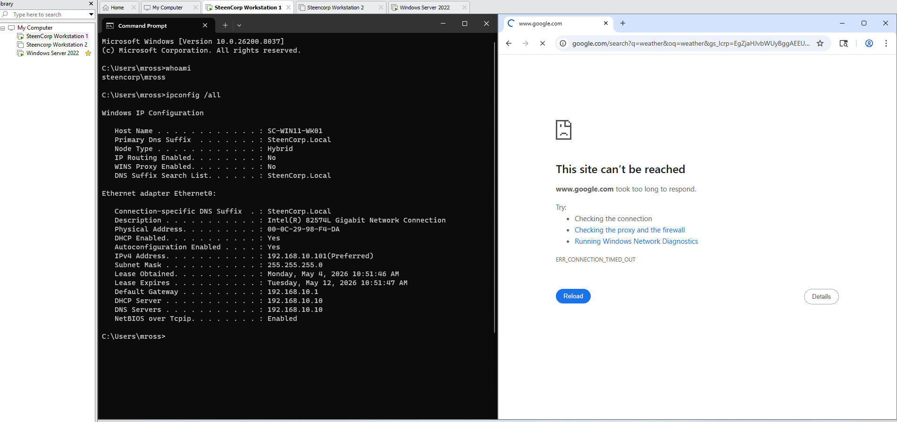

# Ticket #006 – Mike Ross Cannot Access Internet

## Summary

| Field | Details |
|---|---|
| Status | Resolved |
| Priority | Medium |
| Impact | One reported user; issue validated across multiple workstations |
| Category | Network / Internet Connectivity / VMware NAT |
| User | Mike Ross |
| Affected Workstation | `SC-WIN11-WK01` |
| Affected Resource | External internet access |
| Domain | `steencorp.local` |
| Environment | SteenCorp Windows Domain |

---

## User Report

Mike Ross reported that he could sign into the SteenCorp domain but could not access external websites from his workstation.

Internal domain access worked, but Google Chrome could not reach `google.com`.

Browser error:

```text
This site can't be reached
ERR_CONNECTION_TIMED_OUT
```

The issue was first reported by one user, but later validation showed it was related to the lab network design rather than Mike’s account.

---

## Troubleshooting

The issue was first validated from Mike’s workstation.

```cmd
whoami
ipconfig /all
ping 192.168.10.10
ping 192.168.10.1
ping 8.8.8.8
nslookup google.com
ping google.com
```

The signed-in user was confirmed as:

```text
steencorp\mross
```

Mike’s workstation had a valid DHCP lease and could reach DC01 at `192.168.10.10`, which confirmed internal domain connectivity was working.

External DNS resolution also worked through DC01, but traffic to external IP addresses failed. This showed that DNS was not the main issue. The failure was with routing/NAT.

VMware networking was then reviewed.

DC01 had two network adapters: one connected to the internal LAN Segment and one connected to NAT. Mike’s workstation was only connected to the isolated LAN Segment. DC01 could reach the internet through its own NAT adapter, but that did not automatically provide internet access to client workstations.

The lab network was corrected by moving DC01, Workstation 1, and Workstation 2 to VMware NAT-backed `VMnet8`.

VMware DHCP was disabled so DC01 would remain the only DHCP server for the lab.

The actual VMware NAT gateway was confirmed as:

```text
192.168.10.2
```

DC01 and the DHCP scope were updated to use `192.168.10.2` as the default gateway.

A second workstation was tested after the fix. During that validation, Workstation 2 had the correct gateway but still showed `8.8.8.8` as DNS because DNS had been manually configured on the adapter. That adapter was corrected to obtain DNS automatically.

---

## Root Cause

The primary root cause was an isolated VMware LAN Segment with no working NAT/default gateway path to the internet.

Mike’s workstation could reach internal domain resources because it was on the same internal lab network as DC01. However, the isolated LAN Segment did not provide external routing.

DC01 had internet access through a separate NAT adapter, but DC01 was not configured as a router/NAT server for the clients. Because of that, client workstations had no valid path to the internet.

The original gateway value was `192.168.10.1`, but VMware NAT confirmed the active NAT gateway for the corrected `VMnet8` network was `192.168.10.2`.

A secondary issue was also found on Workstation 2: the workstation had manual DNS set to `8.8.8.8` instead of using DC01 for Active Directory DNS.

---

## Resolution

The lab network was moved from the isolated LAN Segment to VMware NAT-backed `VMnet8`.

VMware `VMnet8` was configured for the SteenCorp subnet:

```text
192.168.10.0/24
```

VMware DHCP was disabled so DC01 remained responsible for DHCP and DNS.

DC01 kept its static IP address, but its default gateway was updated:

| Setting | Value |
|---|---|
| DC01 IP Address | `192.168.10.10` |
| Subnet Mask | `255.255.255.0` |
| Default Gateway | `192.168.10.2` |
| DNS Server | `127.0.0.1` |

DHCP Scope Option 003 Router was updated to provide the corrected gateway to clients:

```text
192.168.10.2
```

The client workstations were moved to `VMnet8`, DHCP leases were renewed, and DNS cache was flushed.

```cmd
ipconfig /release
ipconfig /renew
ipconfig /flushdns
```

Workstation 2 was also corrected to obtain DNS automatically, allowing it to receive DC01 as its DNS server:

```text
192.168.10.10
```

---

## Validation

Validation was completed from DC01, Mike Ross’s workstation, and Workstation 2.

Confirmed:

- DC01 retained static IP `192.168.10.10`.
- DC01 used VMware NAT gateway `192.168.10.2`.
- VMware DHCP was disabled.
- DC01 remained the DHCP and DNS server for the lab.
- DHCP Scope Option 003 Router was updated to `192.168.10.2`.
- Mike’s workstation received the corrected gateway.
- Mike’s workstation used DC01 for DHCP and DNS.
- Mike could ping DC01.
- Mike could ping the VMware NAT gateway.
- Mike could ping external IP `8.8.8.8`.
- Mike could resolve and ping `google.com`.
- Mike could browse to Google successfully.
- Workstation 2 was also moved to `VMnet8`.
- Workstation 2 manual DNS was corrected to automatic.
- Workstation 2 received DC01 as DNS.
- Workstation 2 also restored browser internet access.

---

## Evidence

Screenshots are stored in:

```text
Evidence/Helpdesk_Tickets/Ticket006_Mike_Ross_Cannot_Access_Internet/
```

### Mike Ross IP Configuration and Browser Failure

This confirmed Mike was signed into the domain, had a valid DHCP lease, but could not access Google in Chrome.



---

### Internal Connectivity Works, Gateway Fails

This showed the workstation could reach DC01 but could not reach the original gateway or external IP addresses.


---

### DNS Resolves, Routing Fails

This confirmed DNS resolution worked through DC01, but external traffic still failed.


---

### DC01 Dual Network Adapters Before Fix

This showed DC01 had both an internal LAN Segment adapter and a NAT adapter before the network design was corrected.


---

### Workstation LAN Segment Before Fix

This showed the client workstation was connected only to the isolated internal LAN Segment.


---

### VMware NAT VMnet8 Configuration

This documented `VMnet8` configured as a NAT network on the SteenCorp subnet with VMware DHCP disabled.


---

### VMware NAT Gateway Confirmed

This confirmed the active VMware NAT gateway as `192.168.10.2`.


---

### DC01 Moved to VMnet8

This showed DC01 moved to the corrected VMware NAT-backed `VMnet8` network.


---

### Workstation 1 Moved to VMnet8

This showed Mike’s workstation moved from the isolated LAN Segment to `VMnet8`.


---

### Workstation 2 Moved to VMnet8

This showed a second workstation moved to `VMnet8` for broader validation.


---

### DC01 Static IP Updated

This showed DC01 keeping `192.168.10.10` while using `192.168.10.2` as the gateway.


---

### DC01 Gateway and Internet Validation

This confirmed DC01 could reach the VMware NAT gateway and external IP connectivity.


---

### DC01 DNS and Google Validation

This confirmed DC01 could resolve and reach Google after the NAT correction.


---

### DHCP Scope Option 003 Updated

This documented DHCP Scope Option 003 Router updated to `192.168.10.2`.


---

### Mike Ross IP Configuration After Fix

This confirmed Mike’s workstation received the corrected DHCP configuration.


---

### Workstation 2 DNS Issue Found

This showed Workstation 2 received the corrected gateway but still had the wrong DNS server.


---

### Workstation 2 Manual DNS Confirmed

This confirmed Workstation 2 was manually set to use `8.8.8.8` for DNS.


---

### Manual DNS Setting Found

This showed the manual DNS setting in the Workstation 2 IPv4 configuration.


---

### DNS Set to Automatic

This documented Workstation 2 being corrected to obtain DNS automatically.


---

### Workstation 2 DNS Corrected

This confirmed Workstation 2 received DC01 as DNS after renewing its DHCP lease.


---

### Mike Ross Internal and External Connectivity Restored

This confirmed Mike’s workstation could reach DC01, the gateway, and an external IP address.


---

### Mike Ross DNS and Google Connectivity Restored

This confirmed Mike’s workstation could resolve and ping Google through DC01.


---

### Workstation 2 Internal and External Connectivity Restored

This confirmed Workstation 2 could also reach DC01, the gateway, and an external IP address.


---

### Workstation 2 DNS and Google Connectivity Restored

This confirmed Workstation 2 could resolve and ping Google after DNS was corrected.


---

### Mike Ross Browser Internet Access Restored

This validated that Chrome could load Google while signed in as Mike Ross.


---

### Workstation 2 Browser Internet Access Restored

This validated that browser internet access was also restored on Workstation 2.


---

## Skills Demonstrated

- Internet connectivity troubleshooting
- VMware Workstation virtual network troubleshooting
- NAT gateway validation
- DHCP scope option troubleshooting
- DNS validation
- Internal vs external connectivity testing
- Windows network adapter configuration
- Domain client DHCP renewal
- Multi-workstation validation
- Root cause documentation
