# Ticket #007 – Imaging a Defective Workstation and Redeploying for User

## Ticket Summary

| Field | Details |
|---|---|
| Ticket ID | Ticket #007 |
| Status | Resolved |
| Priority | Medium |
| Impact | Single user affected |
| Category | Hardware / Workstation Deployment |
| User | Stanley Hudson |
| Department | Sales |
| Environment | SteenCorp Windows Domain |
| Original Device | `SC-WIN11-WK02` |
| Replacement Device | `SC-WIN11-WK03` |
| Affected Resource | User workstation access, Sales mapped drive, restored user file |
| SLA Response Target | 1 hour |
| SLA Resolution Target | 4 business hours |
| Resolution Status | Resolved within target |

---

## User Report

Stanley Hudson from the Sales department reported that his workstation was defective and no longer usable for normal work.

The user needed a replacement workstation prepared so he could sign into the SteenCorp domain, access his Sales resources, and recover his user-specific file from the original device.

---

## Initial Scope

| Check | Result |
|---|---|
| Issue affects one user | Validated |
| Original workstation treated as defective | Validated |
| User data preservation required | Validated |
| Replacement workstation required | Validated |
| Domain access required | Validated |
| Sales mapped drive access required | Validated |
| HR access should remain restricted | Validated |

---

## Imaging and Redeployment Method

In this lab, VMware virtual machines were used to simulate physical workstations.

`SC-WIN11-WK02` represented Stanley Hudson’s defective workstation, and `SC-WIN11-WK03` represented the replacement device. To simulate a redeployment workflow, the replacement workstation was created in VMware and validated through the same post-deployment checks a technician would perform on a real device.

This included:

- Preserving the original workstation state
- Backing up Stanley’s user file
- Validating the replacement workstation name
- Confirming network connectivity
- Confirming domain membership
- Verifying Active Directory placement
- Refreshing and validating Group Policy
- Restoring user data
- Confirming mapped drives
- Testing restricted share access

The purpose of this ticket was not to reproduce a full enterprise imaging platform, but to practice the support workflow used when a defective workstation needs to be replaced and returned to service.

---

## Priority Classification

| Factor | Assessment |
|---|---|
| Business Impact | Medium |
| User Impact | Single Sales user unable to use assigned workstation |
| Workaround Available | Limited workaround until replacement workstation is prepared |
| Priority | Medium |
| Reason | User is blocked from normal workstation access and department resources |

---

## Troubleshooting Summary

The issue was handled by preserving Stanley Hudson’s user data from the original workstation, backing the file up to a network share, taking a VMware snapshot of the original device, preparing a replacement workstation, validating domain connectivity, restoring the user file, confirming mapped drives, and validating that restricted HR access remained blocked.

| Step | Check Performed | Result |
|---|---|---|
| 1 | Created Stanley-specific test file on original workstation | Completed |
| 2 | Validated test file existed on original workstation | Completed |
| 3 | Created IT backup folder on DC01 | Completed |
| 4 | Backed up Stanley’s file to network share | Completed |
| 5 | Took VMware snapshot of original workstation | Completed |
| 6 | Created replacement workstation `SC-WIN11-WK03` | Completed |
| 7 | Validated network configuration on replacement workstation | DHCP, DNS, gateway validated |
| 8 | Validated workstation name | Confirmed `SC-WIN11-WK03` |
| 9 | Validated domain membership | Confirmed `SteenCorp.Local` |
| 10 | Validated computer object in Workstations OU | Completed |
| 11 | Validated Group Policy application | Drive map GPO applied |
| 12 | Restored Stanley’s backed-up file to replacement workstation | Completed |
| 13 | Confirmed mapped drives | Public and Sales drives mapped |
| 14 | Confirmed Sales folder access | Successful |
| 15 | Tested HR folder access | Restricted through File Explorer |

---

## Commands Used

| Command | Purpose |
|---|---|
| `New-Item` | Create Stanley’s local test folder and backup folder |
| `Set-Content` | Create Stanley’s test file content |
| `Copy-Item` | Back up and restore Stanley’s test folder |
| `ipconfig /all` | Validate IP, DHCP, DNS, and gateway settings |
| `ping 192.168.10.10` | Confirm connectivity to DC01 |
| `nslookup steencorp.local` | Validate internal domain DNS resolution |
| `hostname` | Confirm replacement workstation name |
| `systeminfo \| findstr /B /C:"Domain" /C:"Host Name"` | Validate host name and domain membership |
| `gpresult /r` | Validate applied user Group Policy |
| `whoami` | Confirm signed-in domain user |
| `net use` | Confirm mapped network drives |
| `dir` | Test file paths and shared folder access |
| `type` | Confirm restored file contents |

---

## Evidence

Screenshots and scripts are stored in:

```text
Evidence/Helpdesk_Tickets/Ticket007_Imaging_a_Defective_Workstation_and_Redeploying_for_User/
```

Scripts are stored in:

```text
Evidence/Helpdesk_Tickets/Ticket007_Imaging_a_Defective_Workstation_and_Redeploying_for_User/Scripts/
```

| Evidence | Description |
|---|---|
| Screenshot 00 | PowerShell command used to create Stanley’s test file |
| Screenshot 01 | Stanley’s test file validated on original workstation |
| Screenshot 02 | Backup folder created on DC01 |
| Screenshot 03 | Stanley’s file backed up to network share |
| Screenshot 04 | VMware snapshot created for original workstation |
| Screenshot 05 | Replacement workstation created |
| Screenshot 06 | WK03 network configuration validated |
| Screenshot 07 | WK03 hostname validated |
| Screenshot 08 | WK03 domain membership validated |
| Screenshot 09 | WK03 computer object validated in Workstations OU |
| Screenshot 10 | Group Policy validated for Stanley |
| Screenshot 11 | Stanley’s file restored on WK03 |
| Screenshot 12 | Stanley’s mapped drives and Sales access validated |
| Screenshot 13 | HR share command-line test returned no files |
| Screenshot 13B | HR share access restricted through File Explorer |

---

## Evidence and Scripts

### 1. Stanley Test File Created Using PowerShell

PowerShell was used to create a test folder and test file in Stanley Hudson’s user profile on the original workstation.

This simulated user-specific data that needed to be preserved before the defective workstation was replaced.

**Script Used:**  
[01_Create_Stanley_Test_File.ps1](../../Evidence/Helpdesk_Tickets/Ticket007_Imaging_a_Defective_Workstation_and_Redeploying_for_User/Scripts/01_Create_Stanley_Test_File.ps1)

**Evidence:**  
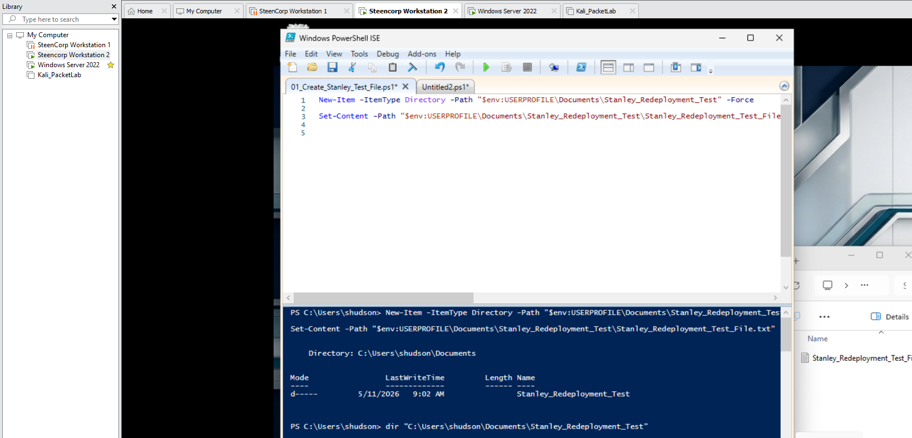

---

### 2. Stanley Test File Validated on Original Workstation

The test file was validated on the original workstation before redeployment.

This confirmed that Stanley had user-specific data that needed to be preserved.

**Evidence:**  
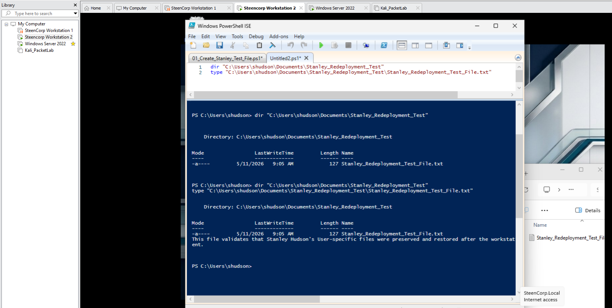

---

### 3. Backup Folder Created on DC01

An IT backup folder was created on DC01 to store Stanley’s recovered workstation data.

Backup path:

```text
\\DC01\SteenCorp_Shares\IT\Device_Backups\Stanley_Hudson_WK02
```

**Script Used:**  
[02_Backup_Folder_Created_On_DC01.ps1](../../Evidence/Helpdesk_Tickets/Ticket007_Imaging_a_Defective_Workstation_and_Redeploying_for_User/Scripts/02_Backup_Folder_Created_On_DC01.ps1)

**Evidence:**  
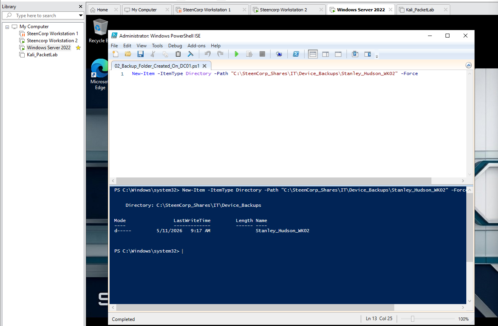

---

### 4. Stanley File Backed Up to Network Share

Stanley’s local test file was copied from the original workstation to the IT backup location on DC01.

This preserved the user file before the defective workstation was removed from active service.

**Evidence:**  
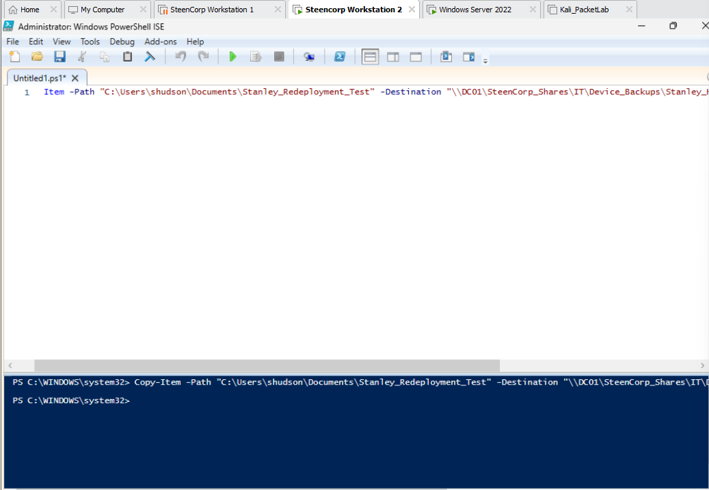

---

### 5. Original Workstation Snapshot Created

A VMware snapshot was taken of `SC-WIN11-WK02` before redeployment.

This preserved the old workstation state before the replacement device was prepared.

**Evidence:**  
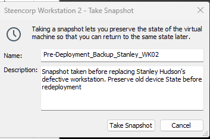

---

### 6. Replacement Workstation Created

`SC-WIN11-WK03` was created as Stanley Hudson’s replacement workstation.

The original workstation, `SC-WIN11-WK02`, was treated as defective and removed from active service for this ticket.

**Evidence:**  
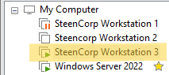

---

### 7. WK03 Network Configuration Validated

The replacement workstation received valid network settings from the SteenCorp environment.

Validated:

- IP address from the SteenCorp subnet
- DHCP server: `192.168.10.10`
- DNS server: `192.168.10.10`
- Default gateway: `192.168.10.2`
- Connectivity to DC01
- Domain DNS resolution

**Evidence:**  
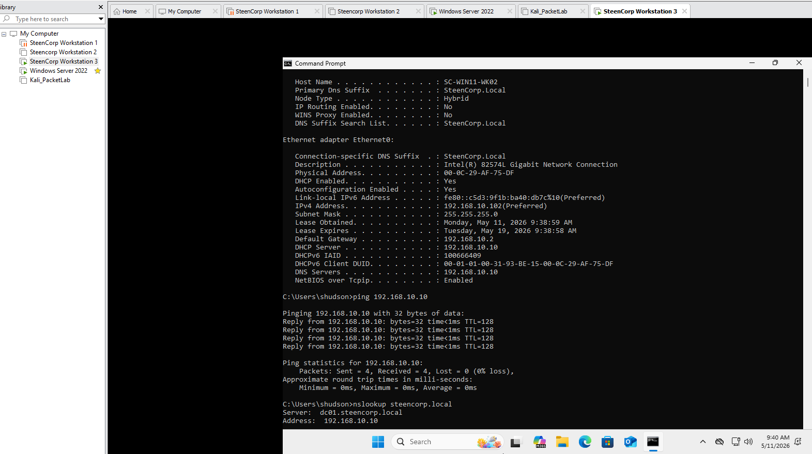

---

### 8. WK03 Hostname Validated

The replacement workstation name was validated as `SC-WIN11-WK03`.

**Script Used:**  
[03_Rename_Workstation_WK03.ps1](../../Evidence/Helpdesk_Tickets/Ticket007_Imaging_a_Defective_Workstation_and_Redeploying_for_User/Scripts/03_Rename_Workstation_WK03.ps1)

**Evidence:**  
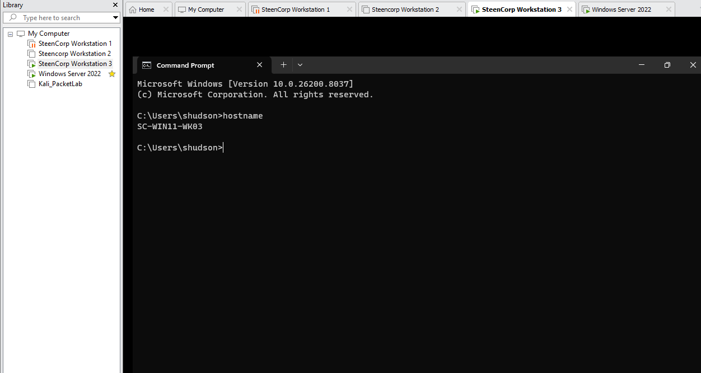

---

### 9. WK03 Domain Membership Validated

The replacement workstation was validated as joined to the SteenCorp domain.

**Evidence:**  
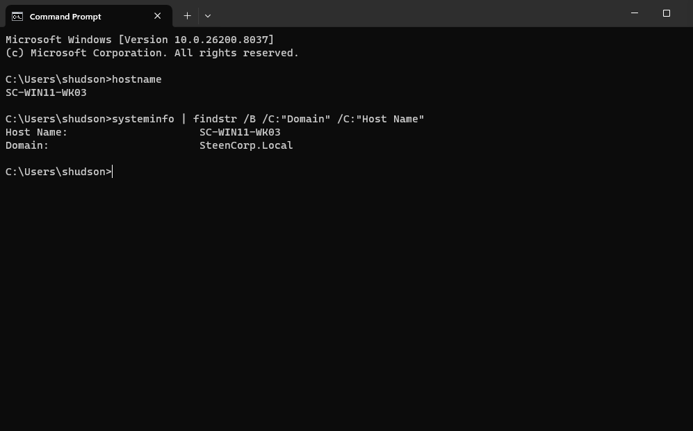

---

### 10. WK03 Computer Object Validated in Workstations OU

`SC-WIN11-WK03` was confirmed in the correct Active Directory Workstations OU.

This confirmed the replacement workstation was positioned to receive the correct workstation policies.

**Evidence:**  
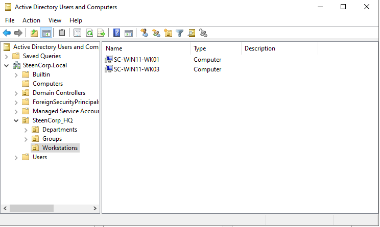

---

### 11. Group Policy Validated

Group Policy was validated from Stanley Hudson’s session.

Applied Group Policy Objects included:

```text
GPO_SteenCorp_Master_Drive_Map
SteenCorp_Wallpaper_Policy
```

**Evidence:**  
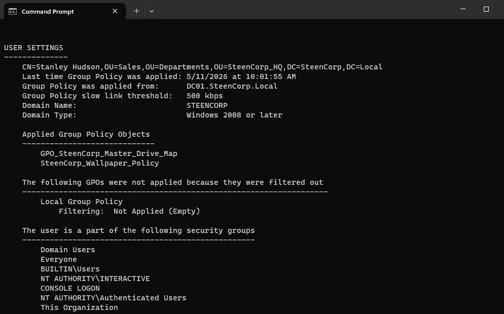

---

### 12. Stanley File Restored on WK03

Stanley’s backed-up test file was restored to his profile on the replacement workstation.

The restored file opened successfully, confirming that the backup and restore process worked.

**Script Used:**  
[05_Restore_Stanley_Test_File.ps1](../../Evidence/Helpdesk_Tickets/Ticket007_Imaging_a_Defective_Workstation_and_Redeploying_for_User/Scripts/05_Restore_Stanley_Test_File.ps1)

**Evidence:**  
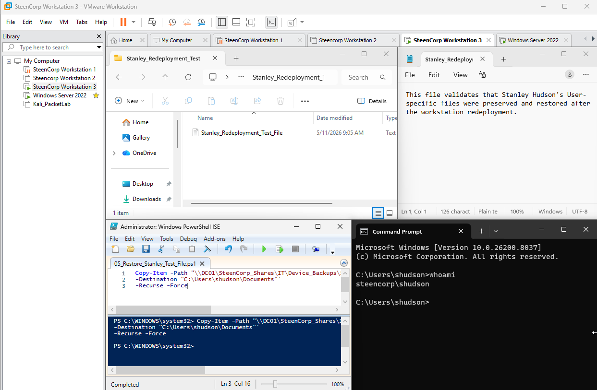

---

### 13. Stanley Mapped Drives Validated

The `net use` command confirmed that Stanley received the expected mapped drives.

Validated mapped drives:

| Drive | Path |
|---|---|
| `P:` | `\\DC01\SteenCorp_Shares\Public` |
| `S:` | `\\DC01\SteenCorp_Shares\Sales` |

The Sales folder was also opened successfully.

**Evidence:**  
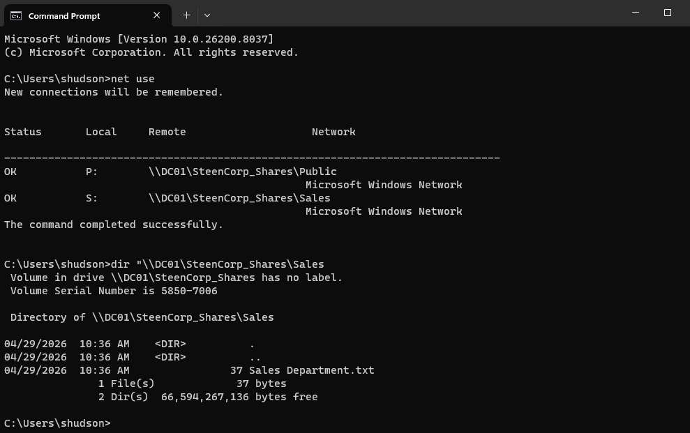

---

### 14. HR Share Command-Line Test

The HR share was tested from Command Prompt.

The command returned `File Not Found`, which showed that the path was reachable but did not confirm an access denial from the command line.

**Evidence:**  
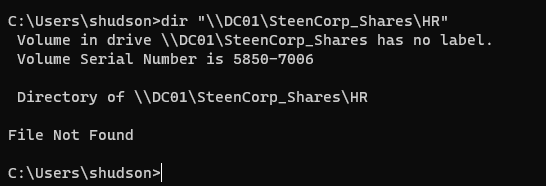

---

### 15. HR Share Restricted Through File Explorer

The HR share was then tested through File Explorer using the UNC path.

Windows returned a permission error stating that Stanley did not have permission to access the HR share.

This confirmed that Stanley’s replacement workstation restored Sales access without granting unauthorized HR access.

**Evidence:**  
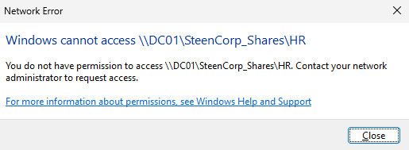

---

## Root Cause

Stanley Hudson’s original workstation, `SC-WIN11-WK02`, was treated as defective and no longer usable for normal work.

The issue required workstation replacement and user data recovery rather than a standard account, password, or permissions fix.

---

## Resolution

Stanley’s user data was preserved from the original workstation, and `SC-WIN11-WK03` was prepared as his replacement device.

The replacement workstation was validated for network connectivity, domain membership, Active Directory placement, Group Policy application, mapped drives, restored user data, and restricted HR access.

---

## Validation

Validation was completed from the replacement Windows 11 workstation while signed in as Stanley Hudson.

Confirmed:

- Stanley’s original test file existed before redeployment.
- Stanley’s file was backed up to the IT network share.
- The original workstation state was preserved with a VMware snapshot.
- `SC-WIN11-WK03` had valid DHCP, DNS, and gateway settings.
- `SC-WIN11-WK03` was joined to `SteenCorp.Local`.
- `SC-WIN11-WK03` appeared in the Workstations OU.
- Stanley’s Group Policy applied successfully.
- Stanley’s test file was restored successfully.
- Stanley received the Public and Sales mapped drives.
- Stanley could access the Sales share.
- Stanley was restricted from accessing the HR share through File Explorer.

---

## Final Ticket Notes

The issue was resolved by preserving Stanley Hudson’s user data and redeploying a replacement workstation.

This ticket demonstrated a workstation replacement workflow involving backup, snapshot preservation, replacement device validation, file restoration, mapped drive testing, and least privilege verification.

Because this was a VMware-based lab simulation, the replacement workstation was created by cloning an existing VM to model the redeployment process. In a production environment, the exact imaging workflow would depend on the organization’s tools and procedures.

---

## Skills Demonstrated

- Workstation imaging and redeployment workflow
- User data backup and restore
- VMware snapshot usage
- Basic PowerShell file creation and copy commands
- Windows workstation validation
- DHCP and DNS validation
- Domain membership validation
- Active Directory computer object validation
- Group Policy validation
- Mapped drive validation
- File share access testing
- Least privilege validation
- Help desk ticket documentation
- User-side validation
- SLA-aware support handling
