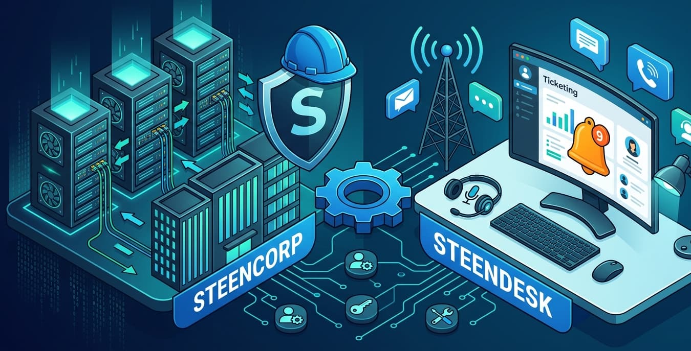

# SteenDesk Help Desk Ticket Simulation

This section documents simulated help desk tickets built on top of the SteenCorp Active Directory lab.

Each ticket follows a support workflow that includes user intake, impact assessment, priority classification, troubleshooting, root cause analysis, resolution, validation, and closure.

---

## Ticket Workflow

| Step | Action | Purpose |
|---|---|---|
| 1 | User Report | Capture the issue from the user’s perspective |
| 2 | Impact & Scope | Determine whether the issue affects one user, one device, one department, or multiple users |
| 3 | Priority Classification | Assign priority based on impact, urgency, and available workaround |
| 4 | Troubleshooting | Validate the issue and gather evidence |
| 5 | Root Cause | Identify what caused the issue |
| 6 | Resolution | Apply the fix |
| 7 | Validation | Confirm the issue is resolved from the user side |
| 8 | Closure | Document the final result and close the ticket |

---

## Priority Guide

| Priority | Impact | Example | Response Target | Resolution Target |
|---|---|---|---|---|
| High | Multiple users or critical business function affected | Department-wide outage, login issue affecting multiple users, server/service unavailable | 15 minutes | 2 business hours |
| Medium | Single user blocked from an important work resource | Missing department drive, account lockout, password reset, DNS issue, internet connectivity issue | 1 hour | 4 business hours |
| Low | Minor issue or request with workaround available | Software request, cosmetic issue, general question | 4 business hours | 1 business day |

---

## Ticket Index

| Ticket | Issue | Category | Priority | Status |
|---|---|---|---|---|
| [Ticket #001](./Tickets/Ticket001_User_Cannot_Access_Shared_Drive.md) | User cannot access Sales shared drive | Access / Permissions | Medium | Resolved |
| [Ticket #002](./Tickets/Ticket002_User_Account_Lockout.md) | User account locked out / sign-in failure | Account / Authentication | Medium | Resolved |
| [Ticket #003](./Tickets/Ticket003_User_Forgot_Password.md) | User forgot password | Account / Password Reset | Medium | Resolved |
| # SteenDesk Help Desk Ticket Simulation

This section documents simulated help desk tickets built on top of the SteenCorp Active Directory lab.

Each ticket follows a support workflow that includes user intake, impact assessment, priority classification, troubleshooting, root cause analysis, resolution, validation, and closure.

---

## Ticket Workflow

| Step | Action | Purpose |
|---|---|---|
| 1 | User Report | Capture the issue from the user’s perspective |
| 2 | Impact & Scope | Determine whether the issue affects one user, one device, one department, or multiple users |
| 3 | Priority Classification | Assign priority based on impact, urgency, and available workaround |
| 4 | Troubleshooting | Validate the issue and gather evidence |
| 5 | Root Cause | Identify what caused the issue |
| 6 | Resolution | Apply the fix |
| 7 | Validation | Confirm the issue is resolved from the user side |
| 8 | Closure | Document the final result and close the ticket |

---

## Priority Guide

| Priority | Impact | Example | Response Target | Resolution Target |
|---|---|---|---|---|
| High | Multiple users or critical business function affected | Department-wide outage, login issue affecting multiple users, server/service unavailable | 15 minutes | 2 business hours |
| Medium | Single user blocked from an important work resource | Missing department drive, account lockout, password reset, DNS issue, internet connectivity issue | 1 hour | 4 business hours |
| Low | Minor issue or request with workaround available | Software request, cosmetic issue, general question | 4 business hours | 1 business day |

---

## Ticket Index

| Ticket | Issue | Category | Priority | Status |
|---|---|---|---|---|
| [Ticket #001](./Tickets/Ticket001_User_Cannot_Access_Shared_Drive.md) | User cannot access Sales shared drive | Access / Permissions | Medium | Resolved |
| [Ticket #002](./Tickets/Ticket002_User_Account_Lockout.md) | User account locked out / sign-in failure | Account / Authentication | Medium | Resolved |
| [Ticket #003](./Tickets/Ticket003_User_Forgot_Password.md) | User forgot password | Account / Password Reset | Medium | Resolved |
| [Ticket #004](./Tickets/Ticket004_User_Cannot_Access_Network_Share_By_Hostname.md) | User cannot access network share by hostname | Network / DNS / Shared Resource Access | Medium | Resolved |
| [Ticket #005](./Tickets/Ticket005_Approved_Software_Install.md) | User cannot install approved software | Workstation / Software Support | Low | Resolved |
| [Ticket #006](./Tickets/Ticket006_Mike_Ross_Cannot_Access_Internet.md) | User cannot access internet | Network / Internet Connectivity / VMware NAT | Medium | Resolved |

---

## Completed Ticket Summary

| Ticket | Main Skill Area | Key Takeaway |
|---|---|---|
| Ticket #001 | Shared drive access | Validated mapped drive access, group membership, and permissions |
| Ticket #002 | Account lockout | Investigated failed login attempts and cleared an Active Directory account lockout |
| Ticket #003 | Password reset | Reset a user password and validated password policy behavior |
| Ticket #004 | DNS troubleshooting | Corrected workstation DNS so hostname-based share access worked |
| Ticket #005 | Approved software install | Installed approved software while maintaining least privilege |
| Ticket #006 | Internet connectivity / NAT | Corrected VMware NAT routing and validated internet access across workstations |

---

## Skills Practiced

- User support troubleshooting
- Priority-based ticket handling
- Impact and scope assessment
- Active Directory account checks
- Group membership validation
- Password reset support
- Account lockout troubleshooting
- Mapped drive troubleshooting
- Group Policy validation
- DNS troubleshooting
- Hostname resolution testing
- VMware virtual network troubleshooting
- NAT gateway validation
- DHCP scope option troubleshooting
- Internet connectivity validation
- Standard user permission troubleshooting
- Approved software installation support
- Least privilege validation
- Root cause documentation
- Ticket documentation | User cannot access network share by hostname | Network / DNS / Shared Resource Access | Medium | Resolved |
| [Ticket #005](./Tickets/Ticket005_Approved_Software_Install.md) | User cannot install approved software | Workstation / Software Support | Low | Resolved |
| [Ticket #006](./Tickets/Ticket006_Mike_Ross_Cannot_Access_Internet.md) | User cannot access internet | Network / Internet Connectivity / VMware NAT | Medium | Resolved |

---

## Completed Ticket Summary

| Ticket | Main Skill Area | Key Takeaway |
|---|---|---|
| Ticket #001 | Shared drive access | Validated mapped drive access, group membership, and permissions |
| Ticket #002 | Account lockout | Investigated failed login attempts and cleared an Active Directory account lockout |
| Ticket #003 | Password reset | Reset a user password and validated password policy behavior |
| Ticket #004 | DNS troubleshooting | Corrected workstation DNS so hostname-based share access worked |
| Ticket #005 | Approved software install | Installed approved software while maintaining least privilege |
| Ticket #006 | Internet connectivity / NAT | Corrected VMware NAT routing and validated internet access across workstations |

---

## Skills Practiced

- User support troubleshooting
- Priority-based ticket handling
- Impact and scope assessment
- Active Directory account checks
- Group membership validation
- Password reset support
- Account lockout troubleshooting
- Mapped drive troubleshooting
- Group Policy validation
- DNS troubleshooting
- Hostname resolution testing
- VMware virtual network troubleshooting
- NAT gateway validation
- DHCP scope option troubleshooting
- Internet connectivity validation
- Standard user permission troubleshooting
- Approved software installation support
- Least privilege validation
- Root cause documentation
- Ticket documentation
